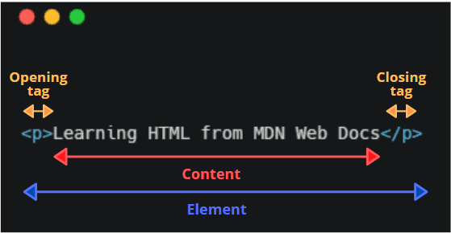
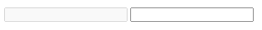
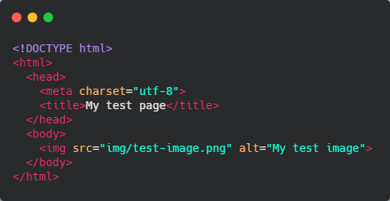

* [Anatomía de un elemento HTML 💀](#user-content--anatomía-de-un-elemento-html)
* [Elementos Anidados 🎡](#user-content--elementos-anidados)
* [Elementos en bloque vs Elementos en línea 🆚](#user-content--elementos-anidados)
* [Elementos Vacíos 🗑](#user-content--elementos-vacíos)
* [Atributos ✅](#user-content--atributos)
* [Atributos Booleanos ✔❌](#user-content--atributos-booleanos)
* [Omitir comillas entre el valor de los atributos 🚫](#user-content--omitir-comillas-entre-el-valor-de-los-atributos)
* [Comillas simples o dobles? 🤔](#user-content--comillas-simples-o-dobles)
* [Anatomía de un documento HTML 💀](#user-content--anatomía-de-un-documento-html)
* [Espacio en blanco en HTML 🗨](#user-content--espacio-en-blanco-en-html)
* [Imágenes 🖼](#user-content--imágenes)
* [Encabezados 🖊](#user-content--encabezados)
* [Párrafos 📄](#user-content--párrafos)
* [Listas 📋](#user-content--listas)
* [Links 🔗](#user-content--links)
* [Entidades de referencia: Incluyendo caracteres especiales en HTML ⚠](#user-content--entidades-de-referencia-incluyendo-caracteres-especiales-en-html)
* [Comentarios en HTML 💭](#user-content--comentarios-en-html)

# 📙 HTML (Hypertext Markup Language)

**HTML** no es un lenguaje de programación, es un lenguaje de marcado, en el cual se define la **estructura** del contenido de una página web. HTML consiste en una serie de **elementos**, los cuales puodríamos usar para encerrar o envolver diferentes partes del contenido.

Las **etiquetas** pueden hacer de una palabra o una imagen un hipervínculo a otro sitio, podríamos cambiar palabras a cursiva, agandar o achicar la letra. 

Para el siguiente contenido:

`Learning HTML from MDN Web Docs`

Si quisiéramos que la línea esté sola, podríamos especificarle que es un párrafo y envolverlo dentro de una etiqueta de párrafo.

`<p>Learning HTML from MDN Web Docs</p>`

Las etiquetas en HTML son insensibles a las mayúsculas o minúsculas, podríamos escribir la etiqueta `<title>`, como `<title>`, `<TITLE>`, `<Title>`, `<TiTlE>`, etc. y funcionarían. Aunque, como buena práctica escribimos las etiquetas HTML en minúsculas por consistencia, legibilidad y otras razones.

## 💀 Anatomía de un elemento HTML

Exploramos la siguiente imágen extrayendo las partes del elemento HTML párrafo presentado anteriormente.



* **Etiqueta de apertura**: Consiste en el nombre del elemento (en este caso **p**), envuelto en paréntesis angulares (o signos de mayor y menor). Es aquí donde el elemento comienza a tomar efecto, en este caso, donde comienza el párrafo.

* **Etiqueta de cierre**: Este es igual que la etiqueta de apertura, excepto que incluye un *slash* entes del nombre del elemento. Indica la finalización del elemento, en este caso, donde termina el párrafo. No agregar etiqueta de cierre es uno de los errores más comunes cuando comenzamos a trabajar con HTML (incluso con experiencia nos podría pasar 😅), ya que esto puede dar errores extraños.

* **El contenido**: Es el contenido del elemento, en este caso es sólo texto.

* **El elemento**: La etiqueta de apertura, el contenido y la etiqueta de cierre juntos, comprenden el elemento HTML.

## 🎡 Elementos Anidados

Podemos poner elementos dentro de otros elementos, es es conocido como **anidamiento**. Si quisiéramos remarcar que estamos aprendiendo HTML podríamos envolverlo en un elemento `<strong>` lo cual hará que la palabra HTML quede resaltada en negrita.

Debemos tener cuidado, en estos casos, de abrir y cerrar bien nuestros elementos, en este caso el elemento `<p>` será padre del elemento `<strong>` por tanto, el código HTML debe quedar de la siguiente manera

`<p>Learning <strong>HTML</strong> from MDN Docs</p>`

## 🆚 Elementos en bloque vs Elementos en línea

Son dos categorías de elementos que debemos conocer

* **Elementos en bloque:** Forman un bloque visible en una página. Estos aparecen en una nueva línea del elemento que les precede. Cualquier contenido de bloque que le sigue a un elemento también aparece en una nueva línea. Son los elementos estructurales de la página, por ejemplo, un elemento de bloque podría estar representado por `headings`, `paragraphs`, `lists`, `navigation menus`, o `footers`. Un elementos de bloque, no puede estar anidado dentro de un bloque en línea, pero si podría estar anidado dentro de un elemento de bloque.

* **Elementos en línea:** Están contenidos dentro de un elemento de bloque y se encuentran en pequeñas partes del contenido de una página. Un elemento en línea no aparece en una nueva línea. Suele utilizarse con texto, por ejemplo, un elemento `<a>` para crear un link, y elementos como `<em>` o `<strong>` para crear énfasis.

En el siguiente código

```
<em>first</em><em>second</em><em>third</em>

<p>fourth</p><p>fifth</p><p>sixth</p>
```

`<em>` es un elemento en línea. Como se puede ver los primeros tres elementos estarán en la misma línea, sin espacio entre ellos. Por otra parte, `<p>`, que es un elemento de bloque, aparecerá en una nueva línea, con espacio debajo de ellos (el espacio se debe al estilo *CSS* asignado por el navegador a los párrafos).

Esto renderizará nuestro navegador

***

*fistsecondthird*

fourth

fifth

sixth

***

Visite [Elementos en Bloque](\\https://developer.mozilla.org/en-US/docs/Web/HTML/Block-level_elements) para ver la lista de elementos en bloque o [Elementos en línea](\\https://developer.mozilla.org/en-US/docs/Web/HTML/Inline_elements) para ver la lista de todos los elementos en línea.

## 🗑 Elementos Vacíos

Algunos elementos no tienen contenido, estos son llamados **elementos vacíos**. Uno de los ejemplos básicos es una imagen

``

Como forma de abreviar esto, también es aceptado escribirlo de la siguiente manera

```
<!-- usar el atributo disabled para hacer que el usuario no pueda escribir en el input -->
<input type="text" disabled>

<!-- Escribir en el input está permitido ya que no está el atributo disabled -->
<input type="text">
```

Este HTML reproduce el siguiente resultado



## 🚫 Omitir comillas entre el valor de los atributos

Omitir comillas dentro del valor del atributo está permitido en algunos casos, pero puede, también, romper nuestro markup, en otros casos. Es por esto que como buena práctica siempre deberíamos escribir el valor de nuestros atributos entre comillas, para ahorrarnos problemas en el futuro. Esto es bueno tenerlo en cuenta ya que en algún momento podríamos ver una página con atributos que no estén entre `""`.

## 🤔 Comillas simples o dobles?

Hasta ahora hemos puesto siempre el valor de los atributos entre comillas dobles. Aunque podríamos ver otros códigos HTML escritos con comillas simples `''`. Esto es cuestión de estilo, podemos elegir la que nos siente mejor. Ambas son equivalentes.

```
<a href="http://www.example.com">A link to my example.</a>

<a href='http://www.example.com'>A link to my example.</a>
```

**NO** se pueden mezclar comillas dobles con comillas simples.

Sin embargo, si usamos un tipo de comillas, podemos incluir otro tipo de comillas dentro del valor del atributo

`<a href="http://www.example.com" title="Isn't this fun?">A link to my example.</a>`

Para usar comillas del mismo tipo dentro de comillas debemos usar [Entidades HTML](#) como en el ejemplo siguiente

`<a href='http://www.example.com' title='Isn&apos;t this fun?'>A link to my example.</a>`

## 💀 Anatomía de un documento HTML

Los elementos no son útiles por si solos, debemos convinarlos para formar una página HTML. Aquí tenemos un ejemplo de un documento HTML básico.



Entonces, aquí vemos lo siguiente:

* `<!DOCTYPE html>` - Es la apertura obligatoria. En estos tiempos no hace mucho, aunque es necesario para asegurarnos de que el documento se comporte de manera correcta.

* `<html></html>` - Es el elemento que envolverá todo el contenido de la página y a veces se lo conoce como el elemento root de la misma.

* `<head></head>` - Este elemento actúa como contenedor de todo lo que queremos incluir en el HTML pero que a su vez no será visto como contenido del mismo. Incluye cosas como keywords, descripción de la página (como tú quieres que aparezca la página en los motores de búsqueda), CSS para darle estilo al contenido, seteo de declaración de caracteres y más.

* `<meta charset="utf-8">` - Este elemento define el conjunto de caracteres que debe usar nuestro documento, UTF-8, que incluye la mayoría de los caracteres de la gran mayoría de los idiomas escritos. De esta forma no tendremos problemas con nuestro contenido escrito.

* `<title></title>` - Define el título de nuestra página, el cual aparecerá en el tab de nuestro navegador.

* `<body></body>` - Es el contenedor de *todo* el contenido visible por los usuarios cuando visitan nuestra página.

## 🗨 Espacio en blanco en HTML

Como se puede notar en los ejemplos que venimos manejando, el espacio en blanco se encuantra en varias partes del código. Esto es opcional, los siguientes dos códigos son equivalentes

```
<p>Dogs are silly.</p>

<p>Dogs        are
         silly.</p>
```

No importa cuanto espacio en blanco uses dentro del contenido de un elemento HTML (el cual puede tener uno o más espacios de caracteres y también saltos de línea), el HTML parseado reduce la secuencia de espacios en blanco a un espacio en blanco cuando renderiza el código.

El espacio en blanco, entonces, lo utilizamos por legibilidad. Es más fácil de entender nuestro código si está mejor formateado.

En nuestro HTML tenemos cada elemento anidado con un *indentado* de dos espacios más que el de fuera.

## 🖼 Imágenes

``

Este elemento incrusta una imagen dentro de nuestra página en la posición que queramos. Esto lo hacemos mediante el atributo `src` (*source*), el cual contiene el path de nuestro archivo de imagen.

Incluímos también, el tributo `alt` (*alternative*). Es una muy buena práctica utilizarlo, principalmente por accesibilidad para los usuarios. Este atributo tiene como valor un texto para los usuarios que no pueden visualizar nuestra imagen, esto se puede dar por las siguientes razones

1. Tienen discapacidad visual. Los usuarios con discapacidad visual, suelen utilizar herramientas para leer el texto alternativo.

2. Algo salió mal y la imagen no se mostró. Porque su path no es el correcto o la imagen no fue encontrada en el servidor.

Es importante tener un buen texto alternativo en nuestras imágenes, que le explique correctamente al usuario de que se trata la misma.

## 🖊 Encabezados

Los elementos de encabezado permiten especificar que cierto contenido de nuestra página es un título o sub-título. HTML contiene **seis** niveles de encabezado, `<h1>`-`<h6>`.

```
<h1>My main title</h1>
<h2>My top level heading</h2>
<h3>My subheading</h3>
<h4>My sub-subheading</h4>
```

A tener en cuenta. No usar el nivel uno de heading para hacer que los textos se vean más grandes o resaltados, ya que estos son usados para *accesibilidad* y *otras razones como SEO*. Hay que tener una secuencia coherente de títulos en nuestra página, sin saltarnos niveles.

## 📄 Párrafos

Estos elementos nos sirven para contener párrafos de texto, los usamos con frecuencia cuando queremos poner texto normal como contenido

`<p>This is a single paragraph</p>`

## 📋 Listas

Los tipos de listas más comunes son las **listas ordenadas** (ordered lists - *ol*) y las **listas desordenadas** (unordered lists - *ul*)

1. **Unordered lists** las utilizamos cuando el orden de los elementos no nos importa. Son representadas con el elemento `<ul>`

2. **Ordered lists** las usamos cuando nos importa el orden de los elementos. Son representadas con el elemento `<ol>`

```
<p>At Mozilla, we`re a global community of</p>

<ul>
  <li>technologists</li>
  <li>thinkers</li>
  <li>builders</li>
</ul>

<p>working together...</p>
```

## 🔗 Links

Los links son muy importantes, estos hacen que la web sea web. Para agregar un link utilizamos el elemento `<a>` (anchor). Para hacer que el texto de un párrafo sea un link hacemos lo siguiente

1. Elegimos algún texto, elegiremos el texto "Click me to go to google"

2. Encierra ese texto dentro de un elemento `<a>`

`<a>Click me to go to google</a>`

3. Ponle al elemento `a` un atributo `href`

`<a href="">Click me to go to google</a>`

4. Pon el valor del atributo con la dirección web que quieras que el link lleve.

`<a href="https://www.google.com">Click me to go to google</a>`

Luego de crear el link hagamos click en el para asegurarnos que nos lleva al sitio donde queremos ir.

Se le llama `href` al atributo porque viene de **h**ypertext **ref**erence (refrencia de hipertexto).

## ⚠ Entidades de referencia: Incluyendo caracteres especiales en HTML

En HTML, `<`, `>`, `"`, `'` y `&` son caracteres especiales. Ellos son parte de la sintáxis HTML. Si quisiéramos utilizar un ampersand o un signo de menor-que, utilizamos los códigos especiales que hacen referencia a los caracteres especiales. Cada referencia de caracter comienza con un ampersand (*&*) y termina con punto y coma (*;*)

| Literal character | Character reference equivalent |
| ----------------- | :----------------------------: |
| <                 | `&lt;`                         |
| >                 | `&gt;`                         |
| "                 | `&quot;`                       |
| '                 | `&apos;`                       |
| &                 | `&amp;`                        |

El caracter de referencia equivalente podríamos recordarlo fácilmente ya que el texto usado es una abreviación de su nombre (en inglés). Puedes leer más sobre entidades HTML y la lista de cada una de las entidades [aquí](\\https://en.wikipedia.org/wiki/List_of_XML_and_HTML_character_entity_references).

En el siguiente ejemplo tenemos dos párrafos

```
<p>In HTML, you define a paragraph using the <p> element.</p>

<p>In HTML, you define a paragraph using the &lt;p&gt; element.</p>
```

En output de este código vemos como en el primer caso nuestro código se rompe, el navegador interpreta que un nuevo elemento párrafo está comenzando, por lo tanto (como vimos antes de elementos en bloque vs en línea), la segunda parte del texto queda debajo de este haciendo que renderice algo que no queremos.

```
In HTML, you define a paragraph using the

element.

In HTML, you define a paragraph using the <p> element.
```

Este es un muy buen caso de uso de una *entidad HTML*.

## 💭 Comentarios en HTML

HTML tiene un mecanismo para escribir comentario en nuestro código. El navegador ignora los comentarios y definitivamente, los comentarios no son visibles por el usuario.

El propósito de los comentarios es que tú, como desarrollador, incluyas notas en el código explicando tu lógica o código. Esto es muy útil para nosotros cuando estamos mucho tiempo sin trabajar en un proyecto y regrasamos, observamos los comentarios y recordamos de manera mucho más fácil porque hicimos lo que hicimos y se hace mucho más sencillo de mantener. También los comentarios son muy importantes cuando son varias las personas que trabajan con un mismo código.

Para escribir un comentario HTML, encierras el contenido en estos marcadores especiales `<!--` y `-->`

```
<p>I'm not inside a comment</p>

<!-- <p>I am!</p> -->
```

En este caso solo veremos en pantalla el párrafo que contiene `I'm not inside a comment`.
