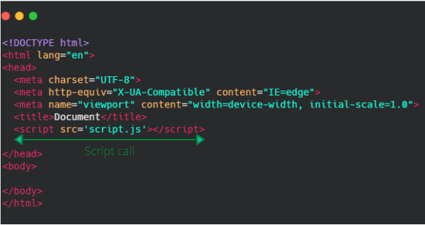
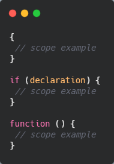
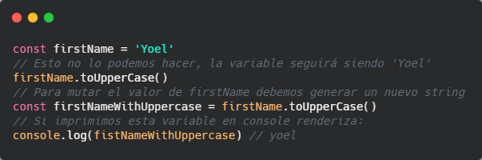
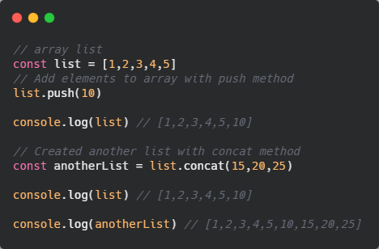
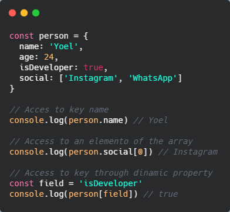
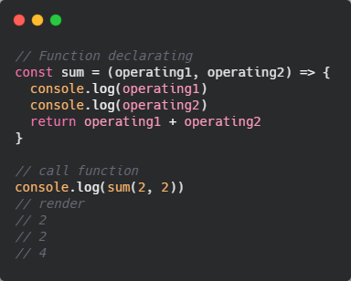
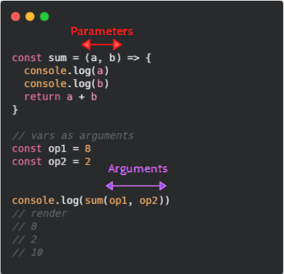
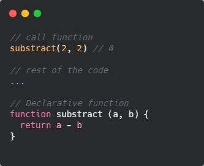

# 😍 JavaScript

Es un lenguaje de programación, es el lenguaje de la web y todo lo que tiene que ver con ella. Es un lenguaje de programación interpretado.

El nombre JavaScript fue adoptado más que nada por temas de marketing, su nombre "*oficial*", por decirlo de alguna manera, es ECMAScript y tiene su propia especificación. JavaScript es como un dialecto que machea directamente con esa especificación.

Como dijimos, es un lenguaje **multiparadigma**, esto quiere decir, que podemos programarlo con diferentes paradigmas de programación

* **Imperativa** Es cuando nosotros le indicamos que es lo que tiene que hacer, le indicamos el control de flujo del programa.

* **Declarativa** Define la lógica del programa, pero no el control del flujo del mismo.

* **Funcional** Evalúa evitando estados y datos mutables. 

* **Orientado a objetos** Trata los campos de datos como objetos y estos pueden ser manipulados unicamente a través de sus métodos.

Otra característica de JavaScript es que su tipado es **débil y dinámico**. 

Que sea **débil** quiere decir que sus variables pueden cambiar su tipo sin ningún problema, podríamos pasar de una variable de tipo *string*, reasignarla y hacer que sea de tipo *number* o *boolean* o lo que queramos. Con un tipado fuerte no lo podríamos hacer.

Que sea **dinámico** quiere decir que JavaScript dinámicamente detecta el tipo de variable que estamos asignando. Si fuese estático deberíamos decirle a las variables el tipo de dato que va a tener.

Lo más típico que vamos a utilizar para llamar a un archivo JavaScript es con la etiqueta `<script>` y lo hacemos dentro de un documento HTML



Tenemos otras formas para poder cargar JavaScript, como escribirlo en línea (como contenido de las etiquetas script) o también cargandolo igual como en la imagen pero agregándole el atributo `type` con el valor `module`. Esta es la forma más moderna de cargar JS. Esto no funciona en IE11. Asignando el tipo le decimos a JS que puede utilizar los ECMAModules, pero por ahora lo dejamos como en la imagen.

Podemos agregar un elemento `<h1>Hola Mundo!</h1>`, para que nuestra página imprima algo. Luego abrimos nuestra página y veremos el *hola mundo* renderizado. Ahora abrimos las herramientas de desarrollo y nos dirigimos a la pestaña *Console*.

En nuestro archivo `script.js` (creado en la raíz) haremos que nos imprima un mensaje en la consola del navegador. Esto lo hacemos con `console.log('Mensaje que queramos imprimir')`. Si guardamos y observamos la consola del navegador veremos que está impreso nuestro mensaje.

## 🗄 Variables

Las variables son como cajas, en las que vamos a guardar información. Son tipos de datos, los cuales son muy importantes en los lenguajes de programación.

Tenemos tres formas de crear una variable en javascript, pero nos vamos a quedar con dos de ellas que son las que utilizamos actualmente.

Para crearla primero le decimos el tipos de variable que es, la forma en la que la vamos a crear, luego el nombre de la variable, luego la asignación que la hacemos con el símbolo de `=` y por último el valor.

`let name = 'Yoel'`

La variable de ejemplo la declaramos utilizando *let*, pero tenemos otras formas de declaración de variables y explicamos sus diferencias

* **let:** Podemos guardar una variable y podemos reasignar su valor, pero dentro del *scope* en el que se encuantra esta variable.
* **const:** Podemos guardar una variable pero NO podemos reasignar su valor. Importante, que no se pueda reasignar, no significa que no pueda cambiar su valor, esto lo vemos más con los tipos de datos de objetos.
* **var:** Podemos guardar una variable y podemos reasignar su valor cualquiera sea el scope en el que se encuentre la misma.

Un **scope**, en javascript, se crea a partir de las `{}`, por tanto cada vez que tenemos un fragmento de código entre llaves, estamos dentro de un scope. En la siguiente imagen tenemos algunos ejemplos de scope en javascript



En una variable podemos guardar todos los **tipos de dato primitivos**, estos son inmutables. El segundo tipo que tiene son los **objetos**, estas son estructuras de datos basadas en objetos y son mutables.

| **Tipos de datos primitivos** | **Objetos**                        |
| ----------------------------- | :--------------------------------: |
| *String*                      | *Arrays*                           |
| *Number*                      | *Objects*                          |
| *Boolean*                     | *Maps*                             |
| *Null*                        | *WithMaps*                         |
| *BigInt*                      | *Sets*                             |
| *Symbol*                      |                                    |


Al decir que los tipos de datos primitivos son inmutables hacemos referencia a que no los podremos mutar directamente, por ejemplo, mutar directamente una variable de tipo string con el método `toUpperCase()` para que quede su texto en minúsculas, nunca podremos cambiar el valor de un tipo de dato primitivo, para esto deberíamos generar un nuevo string en una nueva variable.



Todo lo contrario vemos con los tipos de datos objetos, los cuales si podemos mutar, por ejemplo en un array con el método `push()` utilizado para añadir elementos a un array.

## 👩‍👩‍👧‍👧 Array

Para acceder a un elemento de un array, debemos tener en cuenta que la posición inicial del mismo es 0, por lo tanto si queremos acceder al primer elemento de un array debemos hacerlo con `arrayName[0]`.

Tenemos otros métodos para utilizar con los arrays, uno de ellos es `concat()`, que nos sirve para crear un nuevo array a partir de una que ya tenemos pero sin mutar el primero, toma el primer array el le concatena los elementos que nosotros queramos agregar, es importante, para poder verlo guardar este nuevo array en una variable.



Tenemos diferentes métodos para los arrays, podríamos iterarlos con `forEach()`, podríamos transformar un array con `map()`, son cosas que mirarémos cuando estemos con ReactJS.

## 🗃 Objetos

Dentro de los objetos otro tipo de estructura muy importante son los mismos objetos. Para crear un objeto lo hacemos dentro de `{}`. Esta estructura de dato nos permite tener un **clave** y un **valor**. Para referencia podríamos recordarlo como un diccionario, en el cual, buscamos una palabra clave y obtenemos su valor.

En el valor de una clave podemos poner cualquier tipo de dato (*string*, *number*, *boolean*, *function*, etc).

Para acceder al valor de un objeto lo hacemos con el nombre de la variable un `.` y el nombre de la key.

Para acceder a una propiedad de un objeto dinámicamente lo hacemos mediante `[]` y no con `.`. 



## 🛠 Funciones

Si le queremos dar vida a nuestros programas debemos conocer a las funciones. La primer función que tomaremos como ejemplo es una que al pasarle dos números como parámetros, nos devolverá la suma de los mismos.

Para crear una función creamos una constante (*const*) con el nombre de sum y el valor será una función, para crearla, colocamos paréntesis (los cuales contendrán nuestros parámetros, *operating1* y *operating2*), luego pondremos un signo de `=>` y las llaves `{}` para iniciar el scope de la misma.

Dentro imprimimos por consola los parámetros que nos llegan y retornamos el resultado del operando uno más el operando dos.

Las funciones la mayoría de veces deberían devolver algo.

Para ejecutar una función lo hacemos con el nombre de la misma y los paréntesis pasando los parámetros que nos pide.



Podemos llamar a los parámetros de la manera que queramos, lo importante es referirnos a los parámetros dentro de la función de la misma forma que lo llamamos en la declaración.

Podríamos poner variables como argumento de función, no necesariamente se debe poner un string o un number.

Algo importante a destacar, cuando declaramos la función, a lo que va dentro de los paréntesis se le denomina **parámetro**, pero cuando llamamos a la función para que se ejecute, lo que le pasamos entre paréntesis son los **argumentos** de la misma.



En JavaScript las funciones, las conocemos como **ciudadanos de primera** clase. Esto significa que las funciones son una variable más, las podemos usar tanto como parámetro de una función, como gardarla en una variable, una función puede devolver otra función, en definitiva, decimos que son ciudadanos de primera clase porque podemos hacer lo que sea con ellas.

Hasta ahora vimos una sola forma de escribir una función, pero tenemos diferentes formas de hacerlo. La forma que acabamos de ver se denomina **function expresion**, esto es, cuando a una constante le asignamos una función.

Tenemos otra forma que es **declarando** una función. En siguiente ejemplo, creamos la función *substract*, pero esta vez, será declarada con la palabra `function` al principio, luego le decimos el nombre de la función, después tendremos los paréntesis `()`, dónde le pasamos los parámetros que tendrá, y por último abrimos el scope de la función `{}` dónde haremos la lógica de nuestra función.



Buscar diferencia entre una *function expresion* y una *declarative function*, además de info sobre *hoisting*.

Más allá de que en las funciones declarativas podamos hacer la llamada a la misma desde cualquier parte del código, es bueno seguir una lógica clara y hacer los llamados donde corresponde, es recomendado utilizar las *function expresion* ya que no nos hace pensar en hoisting y tal vez nos da una lógica un poco más ordenada.

De todas maneras, es muy bueno conocer los dos tipos y saber la diferencia entre ellos.

JavaScript es un lenguaje que tiene **inferencia**, lo que hace es inferir el tipo de dato que quieres utilizar, por tanto cuando queremos sumar un número con un string el infiere que nosotros queremos un string

```
2 + "hola" // "2hola"

"hola" + 2 // "hola2"
```

Sin embargo si utilizamos el operador de resta, el infiere que queremos un number

```
2 + "2" - 1 // 21
// Primero hace
2 + "2" // "22"
// Y por último
"22" - 1 // 21
```

⚠ Por tanto, vemos que dependiendo del operador que utilizamos, la inferencia que hace. Es por esto que debemos tener cuidado a la hora de encontrarnos con esto y se considera una buena práctica evitar que la inferencia ocurra.

Es importante, tambiém, a la hora de comparar utilizar los tres símbolos de igual `===`, por lo que comentabamos, si no comparamos de esa manera, javascript infiere los tipos de datos y a veces nos puede dar un resultado que no queremos.

```
// El siguiente ejemplo da true, cuando claramente no son los mismos tipos de datos
2 == "2" // true

// Sin embargo, si utilizamos la comparación con ===
2 === "2" // false

2 === 2 // true

"2" === "2" // true
```

Es buena práctica utilizar la comparación con `===`, ya que no solo mira el valor, sino que también el tipo de dato que estamos utilizando.
