# ‚öõ React

React es una biblioteca JavaScript para crear interfaces de usuario. Actualmente es uno de los frameworks m√°s utilizados y demandado del mercado laboral.

Para comenzar f√°cilmente un projecto en *ReactJS*, abrimos la terminal, nos paramos en la carpeta del proyecto que queremos crear y ejecutamos el comando

`$ npx create-react-app folder_name`

**npx** es un ejecutable que viene de **npm**. *npm* es un administrador de paquetes de *NodeJS*, con npm podemos instalar las dependencias de nuestro proyecto. Con npm viene este ejecutable que se llama *npx*, el cual nos permite, en lugar de instalar un paquete, **ejecutarlo directamente**, en este caso ejecutamos el paquete *create-react-app*.

Luego que nos crea el proyecto, nos movemos a la carpeta del proyecto (en este caso será *part1*) y ponemos en la consola `$ npm start` para que levante nuestro entorno de desarrollo. Si todo salió bien, en el puerto *3000* (http://localhost:3000) tendremos nuestra web con React.

Si observamos la estructura de carpetas y archivos en nuestro editor veremos lo siguiente

* Carpeta **public**: Es la carpeta donde tendremos todos los recursos est√°ticos de nuestra p√°gina (imagenes, favicon, index.html, etc), cualquiera de ellos.

* Carpeta **src**: Es dónde tendremos el código fuente de nuestra página web, en este caso tendremos
  * *App.css*: Tiene los estilos de nuestra app
  * *App.js*: Dónde escribimos react
  * *App.test.js*: Dónde escribiremos test de nuestra app (por ahora, recomendado borrar)
  * *index.css*: Estilos globales de nuestra app
  * *index.js*: Este es el punto de entrada de nuestra app, es uno de los archivos m√°s importantes que tendr√° nuestra app.
  * *logo.svg*: Contiene el logo de React en formato svg

* Archivo **package.json**: Es dónde tendremos el nombre del paquete, la versión, las dependencias, los scripts que podemos utilizar, la configuración del *linter*, los navegadores que soportamos, etc.

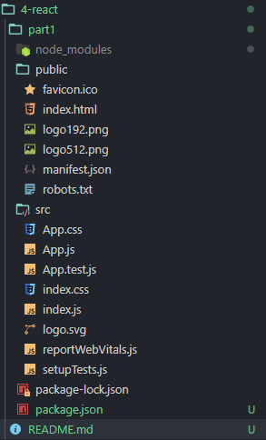

Si vemos nuestro archivo *App.js* es el que est√° renderizando lo que vemos en la web. Lo que haremos es 'limpiar' ese archivo dejando solamente el `div` con la clase `App` y dentro pondremos un `Hola Mundo` de prueba.

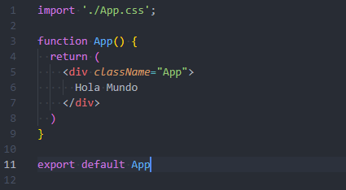

Si miramos la web ahora debería salir nuestro `Hola Mundo`.

## üß© Componentes

Un componente es una parte de nuestra UI que es reutilizable en toda nuestra app.

En nuestro archivo `App.js` podemos ver que un componente no es más que declarar una función. Lo trascendente es que en lugar de que su nombre comience con una minúscula, comienza con mayúscula. Esto es **muy importante**, porque sino cuando utilicemos el componente lo puede interpretar como que es una etiqueta html.

Sabemos que las funciones deben devolver algo, es por esto que dentro del `return` de la misma, estamos devolviendo una especie de html. Aunque es muy parecido, NO es html. Se hizo muy parecido para simplificar el desarrollo con React. Esta estructura parecida a html se denomina **JSX**. Esto es JavaScript puro, pero bonito y se le llama *syntactic sugar*. 

Todo lo que haremos con javascript pasar√° por *babel*.

**Babel** es un *transpilador/compilador*, lo que hace es trasformar nuestro código JavaScript Moderno en código JavaScript entendible por el navegador. Se suele utilizar normalmente para utilizar algunas cosas que son más modernas y nuestro navegador no lo soporta, entonces escribimos el JavaScript más nuevo que queramos y babel nos transpila el código y no nos tendremos que preocupar porque nuestro navegador lo soporte.

Si volvemos a nuestro punto de entrada `index.js`, le decimos puntos de entrada porque es lo primero que ejecutará, a partir de ahí, es como un árbol, irá importando módulos dependencias y lo que tenga para ejecutar, veremos la siguiente estructura


Si observamos el `ReactDOM.render`, vemos que *ReactDOM* es una librería que instala las dependencias necesarias para poder renderizar React en el navegador. Este *ReactDOM* dice lo que tiene que renderizar, en este caso `<App />` y dónde lo va a renderizar `document.getElementById('root')`, o sea, en el elemento html con el *id root*. Ese elemento lo podemos ver en nuestro archivo `index.html` que se encuentra en la carpeta public.

Actualmente para crear un componente de React lo hacemos mediante *funciones*, en alg√∫n momento se crearon con clases, pero actualmente los creamos con funciones.

Así como mencionamos que hay dos formas de escribir funciones, también hay dos formas de escribir componentes, se pueden también escribir con *function expressions*. La ventaja que nos dan es que cuando queremos que un componente solo renderice contenido y no tenga lógica, nos podemos ahorar unas líneas de código, como se observa en el siguiente ejemplo


Dentro de nuestro componente también podemos crear variables. Las escribimos antes del return del component y las utilizamos en nuestro JSX poniendo `{ varName }`. Las `{}` evalúan el contenido que hay en las mismas, nos permiten escribir el JS que queramos, no solo una variable, evaluará cualquier cosa que podamos renderizar.

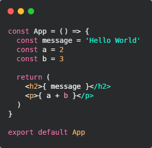

## üî∞ JSX

Si no tuviéramos *JSX* nuestro código sería muy complicado de escribir, mantener y aprender. *JSX* llega para solucionar este problema, su parecido con HTML hace que nuestro código se vea más lindo, prolijo, fácil de aprender y entender, lo que denominamos *syntactic sugar*.

Las etiquetas, dentro de JSX, SIMPRE se deben cerrar, incluso cuando es un elemento sin etiqueta de cierre, igual debe cerrarse por lo menos de esta manera 

``

## üß©üß© M√∫ltiples Componentes

Imaginemos que el título de la app lo quisiéramos utilizar en más de un lugar, podríamos empezar a crear más componentes. Para crear un componente, lo hacemos de la misma manera que el primero, creando una función (en este caso, una *function expression*), le pasamos el nombre del componente, y le decimos que debe renderizar nuestro componente.

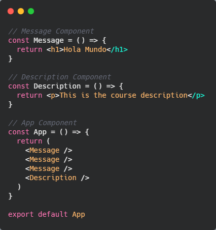

Los componentes se deben crear simpre fuera de cualquier componente, no se deben crear componentes dentro de otros componentes, a pesar de que funciona, no debemos hacerlo. No sólo es buena práctica que esten fuera de otro componente, sino, que también podrían ser **archivos diferentes**.

Podríamos crear el componente `Menssage` en otro archivo, lo exportamos con `export default Message` y luego lo importamos en nuestro component `App`.

## 🏬 Props: Pasando datos a los componentes

Lo m√°s importante es que los componentes se puedan **reutilizar**, es por esto que a los componentes le podemos pasar **props**. Para pasarle props, lo hacemos como si fuese un **atributo HTML** dentro de la etiqueta de nuestro componente.

| 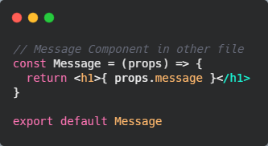 | 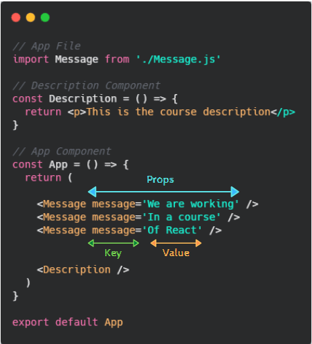 |
| ------ | ------ |

Ahora nos quedó un componente reutilizable al cual podríamos pasarle cualquier valor en su prop y lo renderizará. Podemos pasarle tantas propiedades como queramos.

Para utilizar estilos en línea no se hace como en html que pondríamos `style="color:red;"` sino que le debemos pasar un objeto, como la siguiente forma

```
const Message = (props) => {
  return <h1 style={{ color: props.color}}>{ props.message }</h1>
}
```

Esto nos pintar√° el mensaje del color que le pasemos en su prop *color*.

Se puede ver en algunos ejemplos que utilizamos el `return` sin `()`, esto lo podemos hacer cuando tenemos un retorno de una sola línea, es recomendado, para asegurarnos, utilizar los `()`, pero también tener en cuenta que cuando tenemos un retorno de una sola línea podemos no utilizarlos.

Las funciones simpre deben devolver un solo elemento, es por esto que dentro del return siempre debemos tener un solo elemento envolviendo el resto. Tomando este principio es que vemos que todos los componentes devolver√°n un solo elemento. En caso de que no queramos crear m√°s html existen los **fragments** `<>`.

Hablar sobre desestructuración y oneliner

## üóÇ Estado del componente

Si queremos que nuestros componentes tengan *"vida"* debemos hacer que nuestro componente tenga un estado, el cual cambie cuando ocurre un evento.

Podríamos tener un componente, el cual tiene un contador que ve incrementando en uno cada vez que pasa un segundo y lo podríamos hacer de esta manera


Este component inicializa un contador en valor `0` en la variable `counter`, el cual será pasado como `prop` al componente `App`. Luego tenemos el método `setInterval()`, que ejecutará una sentencia cada determinado período de tiempo. En este caso hacemos que el contador se incremente en uno y volvemos a renderizar el componente a travéz de la función `refresh()`.

Después de esto veremos en pantalla como nuestro contador se va incrementando en uno cada vez que pasa un segundo.

Esta no es la forma en la que manejamos el estado en React. React tiene su propia forma de manejar el estado.

Para tener m√°s claro, que es un estado, tomamos como ejemplo un interruptor, que tiene dos estados (encendido y apagado), como sabemos en que estado se encuentra? porque mediante la luz sabemos si est√° encendido o apagado. En React es lo mismo, tenemos un estado y sabremos en que estado se encuentra seg√∫n lo que refleje en la UI.

Actualmente React para el manejo de estado utiliza los **hooks**, son ganchos que nos permiten esjecutar código en algunos momentos del componente. En el caso del estado es un *gancho* que nos permite engancharle un estado a nuestro componente.

Miremos un ejemplo para nuestro contador con el *hook* **useState**, este lo importamos desde react y lo debemos utilizar dentro del componente donde menejaremos el estado. Algo importante es que no podemos utilizar nuestros hooks dentro de un condicional, ni un loop, ni una función, simpre utilizarlos dentro de nuestro componente y como buena práctica al comienzo del mismo.

Para utilizar el estado con `useState`, debemos llamarlo dentro del componente, este es un método que le debemos pasar como parámetro el valor inicial de nuestro estado. En esta caso le pasamos el valor incial de nuestro contador, por lo tanto será *0*. Este *useState* lo debemos guardar en una variable, en este caso, *counter*, pero el estado se conforma de dos cosas, el **valor** del contador y el **actualizador** del valor del contador. El estado nos devuelve una lista (array) de dos posiciones, donde la primera posición nos devuelve el *valor* del estado y la segunda posición nos devuelve un método donde podemor actualizar el estado.

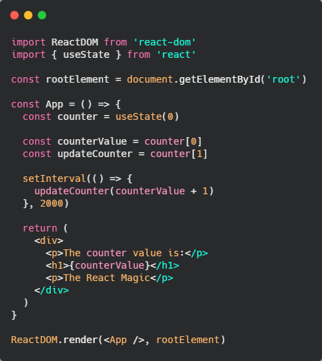

Lo más interesante de esto es que lo único que se volverá a renderizar es el `h1` que está cambiando de valor, no se renderiza todo el componente en el DOM, si inspeccionamos veremos que lo único que se vuelve a renderizar es el valor del contador y no todo el html de nuestro componente, como pasaba con el ejemplo anterior, el cual volvía a renderizar todo.

Ahora, podríamos aplicar desestructuración a este ejemplo. Como ya sabemos que el `useState` nos devuelve un array de dos posiciones lo que podemos hacer es desestructurar ese array en una única variable.

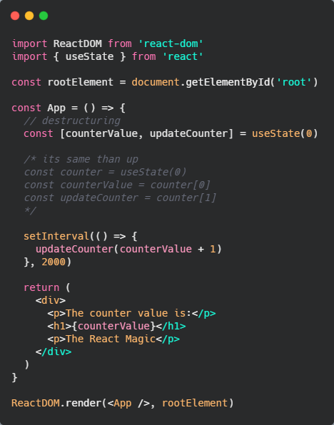

Esta es la forma de agregar un estado a nuestro componente. A partir de ahora lo escribiremos de esa manera (utilizando *destructuring*).

Lo interesante de todo esto, es que cada vez que actualizamos el estado, se vuelve a renderizar el componente desde React, esto quiere decir, que el cuerpo del componente (lo que est√° dentro del return), se vuelve a ejecutar y refleja esos cambios en la *UI del usuario*.

Un componente se vuelve a renderizar cada vez que:

* Cambia el estado
* Cuando le llegan props nuevas, con un valor igual o diferente

Tenemos un problema con el `setInterval()` y es que, como el componente se vuelve a renderizar cada que cambia el estado, el *setInterval* también se vuelve a ejecutar, es por esto que NUNCA debemos utilizar el setInterval de la forma que lo utilizamos en los ejemplos, nos sirvió para explicar alguna cosas, pero no debemos utilizarlo de la forma en la que lo utilizamos.

## üõ¥ Manejo de eventos

Para controlar el estado en React utilizamos los eventos. Los utilizamos para saber cuando ocurre una acción del usuario y que haremos con ella.

Utilizaremos el ejemplo del contador. Tendremos un botón para incrementar nuestro contador en uno cada vez que hacemos click en el.

Para saber cuando hacemos click en el botón tenemos una prop llamada **onClick** y le pasamos como valor una función en la que le decimos que queremos hacer cuando se haga click, en este caso actualizaremos nuestro estado cada vez que se haga click en el.


Tenemos otra forma de actualizar el estado, el `setCounter` no sólo puede recibir el nuevo valor del contador, sino que también puede recibir una función que al ejecutarle le pasemos el nuevo valor del state.

```
setCounter(prevCounter => {
  return prevCounter + 1
})
```

Este método es interesante porque nos aseguramos que *prevCounter* tiene el valor anterior del contador, este método puede ser bueno para cuando tenemos eventos en los que no podemos controlar si el valor se está leyendo desde un scope que tiene un valor antiguo del contador. Con el primer método suele bastar pero es importante conocer este método por si nos encontramos con este error en algún momento.

Un componente dentro del cuerpo de la función puede crear funciones que nos ayuden a hacer lo que queramos. Por ejemplo podemos crear una función `handleClick` que lo que hace es incrementar nuestro contador en uno, así lo único que debemos hacer es llamar a la función cuando el usuario hace click en nuestro botón.

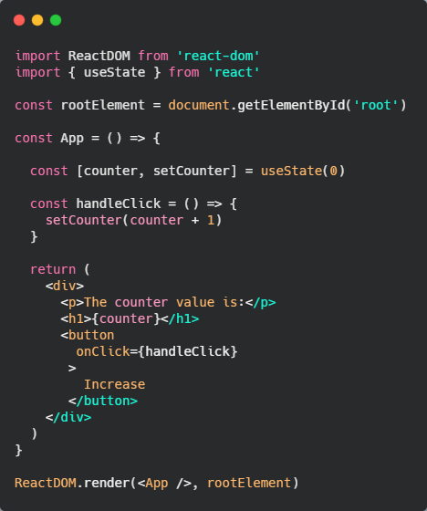

***
**IMPORTANTE**: Al `onClick` debemos pasarle la función, NO la ejecución de la misma, si se la pasamos de esta manera `handleClick()` se romperá y no funcionará. Así que, se la pasamos de la forma que muestra el ejemplo y él la ejecutará sólo cuando se haga click en el botón.
***

A `handleClick` le va a llegar por defecto un parámetro que es el evento que ocurre cuando hacemos click, si hacemos un `console.log(e)` tendremos toda la info del evento que acaba de ocurrir. Podríamos evitar el comportamiento por defecto que tiene un evento con `e.preventDefault()`. Tiene mucha utilidad sobre todo en formularios.

Podríamos tener otro manejo de estado para resetar nuestro contador a 0. Crearíamos un evento `handleClickReset` el cual setea nuestro contador en 0.

Algo importante en React es que debemos tener la *menor cantidad de estados posible*. Esto quiere decir que podemos hacer calculos a partir de un estado ya creado y no crear estados para cada c√°lculo que queremos hacer.

Un ejemplo que podemos utilizar es para saber si el número que estamos viendo en nuestro contador es par o impar. Podríamos crear un estado para esto, pero no es para nada necesario, podemos hacer el cálculo utilizando nuestro estado de contador.

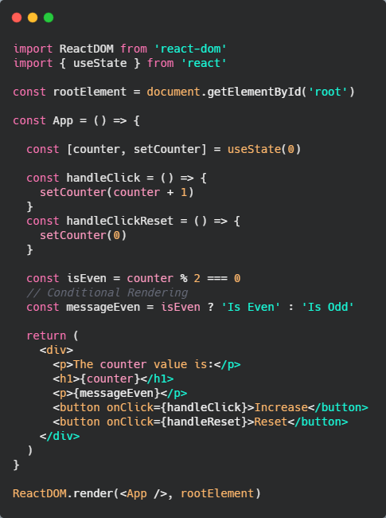

Calculamos si nuestro contador es par en la variable `isEven`, luego en la variable `messageEven` haremos un renderizado condicional con una *ternaria*, si nuestra variable `isEven` nos da `true` renderizaremos un mensaje, en caso contrario renderizamos otro. 

Ahí vemos que cada vez que cambia el estado nuestro componente se vuelve a renderizar, por ende, nuestra variable se vuelve a calcular y por lo tanto cambiará el renderizado diciéndonos si es par o impar.

## üí° Pasar estado a componentes hijos

Comenzamos a ver que nuestro componente comienza a quedarnos un poco largo, es por esto que podríamos empezar a pasar nuestro estado a componentes hijos.

Construímos un componente `Counter` que renderizará el `h1` que dice el número actual de nuestro contador. Recibe como prop el estado de nuestro contador.


Es importante saber en que momento se re-renderizará nuestro componente `Counter`, que lo hará cada vez que se actualice el estado o le lleguen nuevas props. En este caso a counter le llegan nuevas props, cada vez que hacemos click, pero cuando decimos que le llegan esas props, no quiere decir que simpre el valor de estas son nuevas. Por ejemplo, si le damos simepre al botón de *reset*, el valor siempre es 0, por lo tanto el componente no se re-renderizará. Ahora, imaginemos que en vez de pasarle el counter como valor al `number` le pasamos el número *2* como valor estático, si comenzamos a darle al botón de incrementar, vemos que a pesar de tener un valor estático, el componente se re-renderiza cada vez que le damos al botón, esto es porque el estado general del componente `App` se está actualizando y por lo tanto se está volviendo a renderizar todo el componente y con ello el componente `Counter`.

Debemos saber diferenciar el renderizado en React y el renderizado en el DOM, no son lo mismo. El re-renderizado en React ocurre siempre que se actualice un estado o le lleguen props nuevas al componente, el re-renderizado en el DOM ocurre siempre que un elemento del mismo cambie, re-renderiza SOLO el elemento que cambia y no todo su √°rbol.

Destructuring de objectos.

## ‚ö° Estados complejos

En el siguiente ejemplo tendremos dos botones (left y right), cada uno de ellos actualiza un contador, derecha e izquierda. 

| 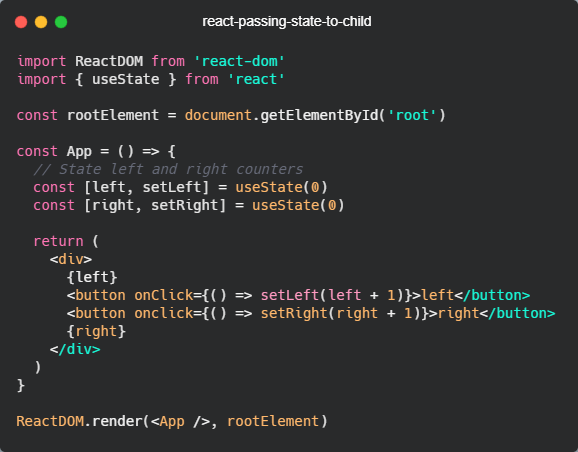 |  |
| ------ | ------ |

Como se ve en el código de ejemplo se crean dos estados, uno actualiza el estado del contador de la izquierda (*setLeft*) y el otro actualizará el estado del contador de la derecha (*setRight*). Lo que se hace en el código (dividir cada estado por separado) es una buena práctica, ya que hace que nuestro código sea muy legible y se entienda a la primera, pero podríamos hacer que ese estado se transforme en uno solo.

Es aquí donde aparecen los estados objetos. Podríamos hacer un objeto dentro del estado donde tenemos dos keys, left y right. Para actualizarlo deberíamos hacer una *helper function* en la que, cuando se hace click actualiza el estado de uno u otro contador.

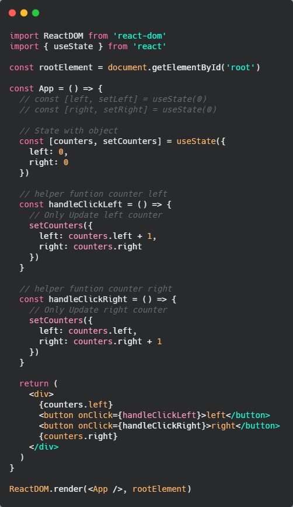

En un estado podemos guardar cualquier cosa. Es este ejemplo vemos que es mejor tener el estado de la primer manera que lo vimos, ya que resulta más fácil de entender, incluso con menos código, pero este es un buen ejemplo para entender como manejaríamos un objeto como estado.

Si quisiéramos que este estado fuese aún más complejo, podríamos crear una key dentro del objeto, llamada *clicks*, que nos dirá la cantidad de clicks que fuimos haciendo.

Un problema que surge es que a medida que nuestro estado va creciendo, resulta difícil de mantener ya que podemos no saber con certeza que es bien lo que tenemos dentro del estado. Además por ejemplo, en el `handleClickLeft` estamos actualizando el contador de la derecha cuando no es lo que realmente queremos actualizar.

Imaginemos que lo hacemos aún más complejo y agregamos otro método al objeto llemado `message`, si nos olvidamos de agregarlo en el manejo de estado cuando hacemos click en un botón, ese mensaje desaparecerá, esto ocurre porque le estamos pasando el estado estáticamente con las claves que queremos cambiar, entonces cuando actualiza el estado no encuentra la key `message` y por ende la pisa.

Es por esto que una buena pr√°ctica cuando tenemos estados complejos es utilizar **spread operator**. Es la forma que tiene JavaScript para decirle que queremos recuperar todas las propiedades que tiene un objeto para guardarlas en otro objeto y luego si, decirle las propiedades que queremos sobre escribir. La sint√°xis que utilizamos es `...objectName`, de esa manera recuperamos todos los datos de un objeto dado. Lo m√°s interesante de esto es que no tendremos que estar escribiendo las propiedades que no queremos cambiar.


A la hora de actualizar el estado, es muy importante saber, que las props y el estado, son **inmutables**, NO deberíamos actualizar nosotros mismos el estado, por ejemplo, en un array con el método `push()`, simpre que actualizamos estado debemos hacerlo con `setState` (de la manera que se muestra en los ejemplos).

Ahora lo que queremos es ver en la UI si al botón que le dimos es el de la derecha o el de la izquierda, poniendo una *L* en caso de que le demos al botón de la izquierda y una *R* en caso de darle al botón de la derecha.

Utilizaremos aquí un nuevo estado `clicks` que recibirá un *Array*, al igual que los objetos, en los arrays podemos utilizar el *spread operator*. En cada uno de los manejadores actualizaremos este estado con una *L* o con una *R* generando un array en `clicks`.

El estado `clicks` además de ser un array que nos dice en que botón hicimos click, también tiene la cantidad total de clicks que hicimos, esto nos permite eliminar del objeto `counters` la propiedad clicks. Esto es una muy buena práctica ya que hace que no tengamos estado de más y así utilizamos un estado para calcular algo que necesitamos.

|  | 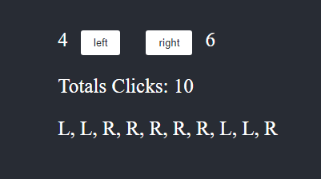 |
| ------ | ------ |

Los estados en React no cuestan caro, es por esto que es importante tener la menor cantidad de estados posible, en este caso nos vino muy bien porque quitamos y ya no tenemos que actualizar el estado de `counters.clicks` cada vez que ocurre un evento sino que lo calculamos directamente de un estado que ya tenemos creado.

Podríamos incluso filtrar el array clicks y de ahí sacar cuantas veces se hizo click en el botón de la izquierda y cuantas en el botón de la derecha y ya quitaríamos el estado de counters.


Aquí podemos ver como con un solo estado hacemos el cálculo de todo lo que precisamos renderizar.

## ‚ùì Renderizado Condicional

Renderizaremos un componente dependiendo una condición dada. En este caso si la cantidad de clicks totales es igual a `0` renderizamos un componente, en caso contrario renderizamos otro.

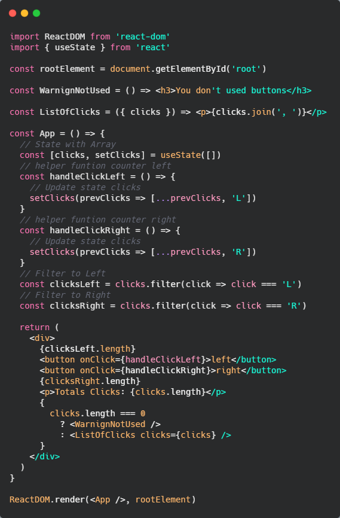

Ahí podemos ver como renderizamos una cosa u otra dependiendo una condición.

Realizar ejercicio dado un valor de inico dado, tener un botón de rest hacia ese valor.
