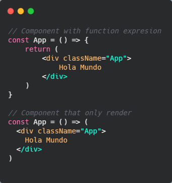
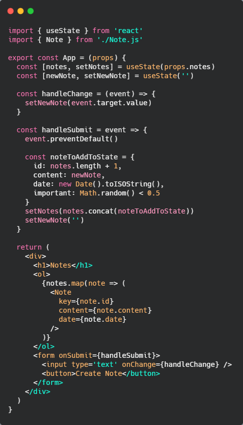

# ⚛ React

React es una biblioteca JavaScript para crear interfaces de usuario. Actualmente es uno de los frameworks más utilizados y demandado del mercado laboral.

Para comenzar fácilmente un projecto en *ReactJS*, abrimos la terminal, nos paramos en la carpeta del proyecto que queremos crear y ejecutamos el comando

`$ npx create-react-app folder_name`

**npx** es un ejecutable que viene de **npm**. *npm* es un administrador de paquetes de *NodeJS*, con npm podemos instalar las dependencias de nuestro proyecto. Con npm viene este ejecutable que se llama *npx*, el cual nos permite, en lugar de instalar un paquete, **ejecutarlo directamente**, en este caso ejecutamos el paquete *create-react-app*.

Luego que nos crea el proyecto, nos movemos a la carpeta del proyecto (en este caso será *part1*) y ponemos en la consola `$ npm start` para que levante nuestro entorno de desarrollo. Si todo salió bien, en el puerto *3000* (http://localhost:3000) tendremos nuestra web con React.

Si observamos la estructura de carpetas y archivos en nuestro editor veremos lo siguiente

* Carpeta **public**: Es la carpeta donde tendremos todos los recursos estáticos de nuestra página (imagenes, favicon, index.html, etc), cualquiera de ellos.

* Carpeta **src**: Es dónde tendremos el código fuente de nuestra página web, en este caso tendremos
  * *App.css*: Tiene los estilos de nuestra app
  * *App.js*: Dónde escribimos react
  * *App.test.js*: Dónde escribiremos test de nuestra app (por ahora, recomendado borrar)
  * *index.css*: Estilos globales de nuestra app
  * *index.js*: Este es el punto de entrada de nuestra app, es uno de los archivos más importantes que tendrá nuestra app.
  * *logo.svg*: Contiene el logo de React en formato svg

* Archivo **package.json**: Es dónde tendremos el nombre del paquete, la versión, las dependencias, los scripts que podemos utilizar, la configuración del *linter*, los navegadores que soportamos, etc.


Si vemos nuestro archivo *App.js* es el que está renderizando lo que vemos en la web. Lo que haremos es 'limpiar' ese archivo dejando solamente el `div` con la clase `App` y dentro pondremos un `Hola Mundo` de prueba.


Si miramos la web ahora debería salir nuestro `Hola Mundo`.

## 🧩 Componentes

Un componente es una parte de nuestra UI que es reutilizable en toda nuestra app.

En nuestro archivo `App.js` podemos ver que un componente no es más que declarar una función. Lo trascendente es que en lugar de que su nombre comience con una minúscula, comienza con mayúscula. Esto es **muy importante**, porque sino cuando utilicemos el componente lo puede interpretar como que es una etiqueta html.

Sabemos que las funciones deben devolver algo, es por esto que dentro del `return` de la misma, estamos devolviendo una especie de html. Aunque es muy parecido, NO es html. Se hizo muy parecido para simplificar el desarrollo con React. Esta estructura parecida a html se denomina **JSX**. Esto es JavaScript puro, pero bonito y se le llama *syntactic sugar*. 

Todo lo que haremos con javascript pasará por *babel*.

**Babel** es un *transpilador/compilador*, lo que hace es trasformar nuestro código JavaScript Moderno en código JavaScript entendible por el navegador. Se suele utilizar normalmente para utilizar algunas cosas que son más modernas y nuestro navegador no lo soporta, entonces escribimos el JavaScript más nuevo que queramos y babel nos transpila el código y no nos tendremos que preocupar porque nuestro navegador lo soporte.

Si volvemos a nuestro punto de entrada `index.js`, le decimos puntos de entrada porque es lo primero que ejecutará, a partir de ahí, es como un árbol, irá importando módulos dependencias y lo que tenga para ejecutar, veremos la siguiente estructura


Si observamos el `ReactDOM.render`, vemos que *ReactDOM* es una librería que instala las dependencias necesarias para poder renderizar React en el navegador. Este *ReactDOM* dice lo que tiene que renderizar, en este caso `<App />` y dónde lo va a renderizar `document.getElementById('root')`, o sea, en el elemento html con el *id root*. Ese elemento lo podemos ver en nuestro archivo `index.html` que se encuentra en la carpeta public.

Actualmente para crear un componente de React lo hacemos mediante *funciones*, en algún momento se crearon con clases, pero actualmente los creamos con funciones.

Así como mencionamos que hay dos formas de escribir funciones, también hay dos formas de escribir componentes, se pueden también escribir con *function expressions*. La ventaja que nos dan es que cuando queremos que un componente solo renderice contenido y no tenga lógica, nos podemos ahorar unas líneas de código, como se observa en el siguiente ejemplo



Dentro de nuestro componente también podemos crear variables. Las escribimos antes del return del component y las utilizamos en nuestro JSX poniendo `{ varName }`. Las `{}` evalúan el contenido que hay en las mismas, nos permiten escribir el JS que queramos, no solo una variable, evaluará cualquier cosa que podamos renderizar.


## 🔰 JSX

Si no tuviéramos *JSX* nuestro código sería muy complicado de escribir, mantener y aprender. *JSX* llega para solucionar este problema, su parecido con HTML hace que nuestro código se vea más lindo, prolijo, fácil de aprender y entender, lo que denominamos *syntactic sugar*.

Las etiquetas, dentro de JSX, SIMPRE se deben cerrar, incluso cuando es un elemento sin etiqueta de cierre, igual debe cerrarse por lo menos de esta manera 

``

## 🧩🧩 Múltiples Componentes

Imaginemos que el título de la app lo quisiéramos utilizar en más de un lugar, podríamos empezar a crear más componentes. Para crear un componente, lo hacemos de la misma manera que el primero, creando una función (en este caso, una *function expression*), le pasamos el nombre del componente, y le decimos que debe renderizar nuestro componente.


Los componentes se deben crear simpre fuera de cualquier componente, no se deben crear componentes dentro de otros componentes, a pesar de que funciona, no debemos hacerlo. No sólo es buena práctica que esten fuera de otro componente, sino, que también podrían ser **archivos diferentes**.

Podríamos crear el componente `Menssage` en otro archivo, lo exportamos con `export default Message` y luego lo importamos en nuestro component `App`.

## 🏬 Props: Pasando datos a los componentes

Lo más importante es que los componentes se puedan **reutilizar**, es por esto que a los componentes le podemos pasar **props**. Para pasarle props, lo hacemos como si fuese un **atributo HTML** dentro de la etiqueta de nuestro componente.

|  |  |
| ------ | ------ |

Ahora nos quedó un componente reutilizable al cual podríamos pasarle cualquier valor en su prop y lo renderizará. Podemos pasarle tantas propiedades como queramos.

Para utilizar estilos en línea no se hace como en html que pondríamos `style="color:red;"` sino que le debemos pasar un objeto, como la siguiente forma

```
const Message = (props) => {
  return <h1 style={{ color: props.color}}>{ props.message }</h1>
}
```

Esto nos pintará el mensaje del color que le pasemos en su prop *color*.

Se puede ver en algunos ejemplos que utilizamos el `return` sin `()`, esto lo podemos hacer cuando tenemos un retorno de una sola línea, es recomendado, para asegurarnos, utilizar los `()`, pero también tener en cuenta que cuando tenemos un retorno de una sola línea podemos no utilizarlos.

Las funciones simpre deben devolver un solo elemento, es por esto que dentro del return siempre debemos tener un solo elemento envolviendo el resto. Tomando este principio es que vemos que todos los componentes devolverán un solo elemento. En caso de que no queramos crear más html existen los **fragments** `<>`.

Hablar sobre desestructuración y oneliner

## 🗂 Estado del componente

Si queremos que nuestros componentes tengan *"vida"* debemos hacer que nuestro componente tenga un estado, el cual cambie cuando ocurre un evento.

Podríamos tener un componente, el cual tiene un contador que ve incrementando en uno cada vez que pasa un segundo y lo podríamos hacer de esta manera


Este component inicializa un contador en valor `0` en la variable `counter`, el cual será pasado como `prop` al componente `App`. Luego tenemos el método `setInterval()`, que ejecutará una sentencia cada determinado período de tiempo. En este caso hacemos que el contador se incremente en uno y volvemos a renderizar el componente a travéz de la función `refresh()`.

Después de esto veremos en pantalla como nuestro contador se va incrementando en uno cada vez que pasa un segundo.

Esta no es la forma en la que manejamos el estado en React. React tiene su propia forma de manejar el estado.

Para tener más claro, que es un estado, tomamos como ejemplo un interruptor, que tiene dos estados (encendido y apagado), como sabemos en que estado se encuentra? porque mediante la luz sabemos si está encendido o apagado. En React es lo mismo, tenemos un estado y sabremos en que estado se encuentra según lo que refleje en la UI.

Actualmente React para el manejo de estado utiliza los **hooks**, son ganchos que nos permiten esjecutar código en algunos momentos del componente. En el caso del estado es un *gancho* que nos permite engancharle un estado a nuestro componente.

Miremos un ejemplo para nuestro contador con el *hook* **useState**, este lo importamos desde react y lo debemos utilizar dentro del componente donde menejaremos el estado. Algo importante es que no podemos utilizar nuestros hooks dentro de un condicional, ni un loop, ni una función, simpre utilizarlos dentro de nuestro componente y como buena práctica al comienzo del mismo.

Para utilizar el estado con `useState`, debemos llamarlo dentro del componente, este es un método que le debemos pasar como parámetro el valor inicial de nuestro estado. En esta caso le pasamos el valor incial de nuestro contador, por lo tanto será *0*. Este *useState* lo debemos guardar en una variable, en este caso, *counter*, pero el estado se conforma de dos cosas, el **valor** del contador y el **actualizador** del valor del contador. El estado nos devuelve una lista (array) de dos posiciones, donde la primera posición nos devuelve el *valor* del estado y la segunda posición nos devuelve un método donde podemor actualizar el estado.


Lo más interesante de esto es que lo único que se volverá a renderizar es el `h1` que está cambiando de valor, no se renderiza todo el componente en el DOM, si inspeccionamos veremos que lo único que se vuelve a renderizar es el valor del contador y no todo el html de nuestro componente, como pasaba con el ejemplo anterior, el cual volvía a renderizar todo.

Ahora, podríamos aplicar desestructuración a este ejemplo. Como ya sabemos que el `useState` nos devuelve un array de dos posiciones lo que podemos hacer es desestructurar ese array en una única variable.


Esta es la forma de agregar un estado a nuestro componente. A partir de ahora lo escribiremos de esa manera (utilizando *destructuring*).

Lo interesante de todo esto, es que cada vez que actualizamos el estado, se vuelve a renderizar el componente desde React, esto quiere decir, que el cuerpo del componente (lo que está dentro del return), se vuelve a ejecutar y refleja esos cambios en la *UI del usuario*.

Un componente se vuelve a renderizar cada vez que:

* Cambia el estado
* Cuando le llegan props nuevas, con un valor igual o diferente

Tenemos un problema con el `setInterval()` y es que, como el componente se vuelve a renderizar cada que cambia el estado, el *setInterval* también se vuelve a ejecutar, es por esto que NUNCA debemos utilizar el setInterval de la forma que lo utilizamos en los ejemplos, nos sirvió para explicar alguna cosas, pero no debemos utilizarlo de la forma en la que lo utilizamos.

## 🛴 Manejo de eventos

Para controlar el estado en React utilizamos los eventos. Los utilizamos para saber cuando ocurre una acción del usuario y que haremos con ella.

Utilizaremos el ejemplo del contador. Tendremos un botón para incrementar nuestro contador en uno cada vez que hacemos click en el.

Para saber cuando hacemos click en el botón tenemos una prop llamada **onClick** y le pasamos como valor una función en la que le decimos que queremos hacer cuando se haga click, en este caso actualizaremos nuestro estado cada vez que se haga click en el.


Tenemos otra forma de actualizar el estado, el `setCounter` no sólo puede recibir el nuevo valor del contador, sino que también puede recibir una función que al ejecutarle le pasemos el nuevo valor del state.

```
setCounter(prevCounter => {
  return prevCounter + 1
})
```

Este método es interesante porque nos aseguramos que *prevCounter* tiene el valor anterior del contador, este método puede ser bueno para cuando tenemos eventos en los que no podemos controlar si el valor se está leyendo desde un scope que tiene un valor antiguo del contador. Con el primer método suele bastar pero es importante conocer este método por si nos encontramos con este error en algún momento.

Un componente dentro del cuerpo de la función puede crear funciones que nos ayuden a hacer lo que queramos. Por ejemplo podemos crear una función `handleClick` que lo que hace es incrementar nuestro contador en uno, así lo único que debemos hacer es llamar a la función cuando el usuario hace click en nuestro botón.


***
**IMPORTANTE**: Al `onClick` debemos pasarle la función, NO la ejecución de la misma, si se la pasamos de esta manera `handleClick()` se romperá y no funcionará. Así que, se la pasamos de la forma que muestra el ejemplo y él la ejecutará sólo cuando se haga click en el botón.
***

A `handleClick` le va a llegar por defecto un parámetro que es el evento que ocurre cuando hacemos click, si hacemos un `console.log(e)` tendremos toda la info del evento que acaba de ocurrir. Podríamos evitar el comportamiento por defecto que tiene un evento con `e.preventDefault()`. Tiene mucha utilidad sobre todo en formularios.

Podríamos tener otro manejo de estado para resetar nuestro contador a 0. Crearíamos un evento `handleClickReset` el cual setea nuestro contador en 0.

Algo importante en React es que debemos tener la *menor cantidad de estados posible*. Esto quiere decir que podemos hacer calculos a partir de un estado ya creado y no crear estados para cada cálculo que queremos hacer.

Un ejemplo que podemos utilizar es para saber si el número que estamos viendo en nuestro contador es par o impar. Podríamos crear un estado para esto, pero no es para nada necesario, podemos hacer el cálculo utilizando nuestro estado de contador.


Calculamos si nuestro contador es par en la variable `isEven`, luego en la variable `messageEven` haremos un renderizado condicional con una *ternaria*, si nuestra variable `isEven` nos da `true` renderizaremos un mensaje, en caso contrario renderizamos otro. 

Ahí vemos que cada vez que cambia el estado nuestro componente se vuelve a renderizar, por ende, nuestra variable se vuelve a calcular y por lo tanto cambiará el renderizado diciéndonos si es par o impar.

## 💡 Pasar estado a componentes hijos

Comenzamos a ver que nuestro componente comienza a quedarnos un poco largo, es por esto que podríamos empezar a pasar nuestro estado a componentes hijos.

Construímos un componente `Counter` que renderizará el `h1` que dice el número actual de nuestro contador. Recibe como prop el estado de nuestro contador.


Es importante saber en que momento se re-renderizará nuestro componente `Counter`, que lo hará cada vez que se actualice el estado o le lleguen nuevas props. En este caso a counter le llegan nuevas props, cada vez que hacemos click, pero cuando decimos que le llegan esas props, no quiere decir que simpre el valor de estas son nuevas. Por ejemplo, si le damos simepre al botón de *reset*, el valor siempre es 0, por lo tanto el componente no se re-renderizará. Ahora, imaginemos que en vez de pasarle el counter como valor al `number` le pasamos el número *2* como valor estático, si comenzamos a darle al botón de incrementar, vemos que a pesar de tener un valor estático, el componente se re-renderiza cada vez que le damos al botón, esto es porque el estado general del componente `App` se está actualizando y por lo tanto se está volviendo a renderizar todo el componente y con ello el componente `Counter`.

Debemos saber diferenciar el renderizado en React y el renderizado en el DOM, no son lo mismo. El re-renderizado en React ocurre siempre que se actualice un estado o le lleguen props nuevas al componente, el re-renderizado en el DOM ocurre siempre que un elemento del mismo cambie, re-renderiza SOLO el elemento que cambia y no todo su árbol.

Destructuring de objectos.

## ⚡ Estados complejos

En el siguiente ejemplo tendremos dos botones (left y right), cada uno de ellos actualiza un contador, derecha e izquierda. 

|  |  |
| ------ | ------ |

Como se ve en el código de ejemplo se crean dos estados, uno actualiza el estado del contador de la izquierda (*setLeft*) y el otro actualizará el estado del contador de la derecha (*setRight*). Lo que se hace en el código (dividir cada estado por separado) es una buena práctica, ya que hace que nuestro código sea muy legible y se entienda a la primera, pero podríamos hacer que ese estado se transforme en uno solo.

Es aquí donde aparecen los estados objetos. Podríamos hacer un objeto dentro del estado donde tenemos dos keys, left y right. Para actualizarlo deberíamos hacer una *helper function* en la que, cuando se hace click actualiza el estado de uno u otro contador.


En un estado podemos guardar cualquier cosa. Es este ejemplo vemos que es mejor tener el estado de la primer manera que lo vimos, ya que resulta más fácil de entender, incluso con menos código, pero este es un buen ejemplo para entender como manejaríamos un objeto como estado.

Si quisiéramos que este estado fuese aún más complejo, podríamos crear una key dentro del objeto, llamada *clicks*, que nos dirá la cantidad de clicks que fuimos haciendo.

Un problema que surge es que a medida que nuestro estado va creciendo, resulta difícil de mantener ya que podemos no saber con certeza que es bien lo que tenemos dentro del estado. Además por ejemplo, en el `handleClickLeft` estamos actualizando el contador de la derecha cuando no es lo que realmente queremos actualizar.

Imaginemos que lo hacemos aún más complejo y agregamos otro método al objeto llemado `message`, si nos olvidamos de agregarlo en el manejo de estado cuando hacemos click en un botón, ese mensaje desaparecerá, esto ocurre porque le estamos pasando el estado estáticamente con las claves que queremos cambiar, entonces cuando actualiza el estado no encuentra la key `message` y por ende la pisa.

Es por esto que una buena práctica cuando tenemos estados complejos es utilizar **spread operator**. Es la forma que tiene JavaScript para decirle que queremos recuperar todas las propiedades que tiene un objeto para guardarlas en otro objeto y luego si, decirle las propiedades que queremos sobre escribir. La sintáxis que utilizamos es `...objectName`, de esa manera recuperamos todos los datos de un objeto dado. Lo más interesante de esto es que no tendremos que estar escribiendo las propiedades que no queremos cambiar.


A la hora de actualizar el estado, es muy importante saber, que las props y el estado, son **inmutables**, NO deberíamos actualizar nosotros mismos el estado, por ejemplo, en un array con el método `push()`, simpre que actualizamos estado debemos hacerlo con `setState` (de la manera que se muestra en los ejemplos).

Ahora lo que queremos es ver en la UI si al botón que le dimos es el de la derecha o el de la izquierda, poniendo una *L* en caso de que le demos al botón de la izquierda y una *R* en caso de darle al botón de la derecha.

Utilizaremos aquí un nuevo estado `clicks` que recibirá un *Array*, al igual que los objetos, en los arrays podemos utilizar el *spread operator*. En cada uno de los manejadores actualizaremos este estado con una *L* o con una *R* generando un array en `clicks`.

El estado `clicks` además de ser un array que nos dice en que botón hicimos click, también tiene la cantidad total de clicks que hicimos, esto nos permite eliminar del objeto `counters` la propiedad clicks. Esto es una muy buena práctica ya que hace que no tengamos estado de más y así utilizamos un estado para calcular algo que necesitamos.

|  |  |
| ------ | ------ |

Los estados en React no cuestan caro, es por esto que es importante tener la menor cantidad de estados posible, en este caso nos vino muy bien porque quitamos y ya no tenemos que actualizar el estado de `counters.clicks` cada vez que ocurre un evento sino que lo calculamos directamente de un estado que ya tenemos creado.

Podríamos incluso filtrar el array clicks y de ahí sacar cuantas veces se hizo click en el botón de la izquierda y cuantas en el botón de la derecha y ya quitaríamos el estado de counters.


Aquí podemos ver como con un solo estado hacemos el cálculo de todo lo que precisamos renderizar.

## ❓ Renderizado Condicional

Renderizaremos un componente dependiendo una condición dada. En este caso si la cantidad de clicks totales es igual a `0` renderizamos un componente, en caso contrario renderizamos otro.


Ahí podemos ver como renderizamos una cosa u otra dependiendo una condición.

Realizar ejercicio dado un valor de inico dado, tener un botón de rest hacia ese valor.

## 🧱 Renderizar lista de elementos

Crearemos un array notes, donde tendremos tres elementos. Para renderizar estos elementos debemos utilizar un me´todo que tienen los array, llamado `map()`, este no solo nos permite transformar valores en cada iteración sino que cuando lo utilizamos devolvemos cada uno de los elementos transformados.

¿Por qué no utilizamos `forEach`? Cuando iteramos un array, el *forEach*, no nos devuelve nada, no hace *return* de ningún valor, es por esto que utilizamos el `map()`.

Lo mejor que podemos hacer dentro del `map()` es que podemos aprovechar JSX y meterlo en el return para que devuelve un HTML con los datos que nosotros necesitamos de cada elemento del array notes.


Esto nos imprime el **contenido** y la **fecha** de cada nota. Importante recordar que `note.content` esa es la forma en la que accedemos a una key en un objeto.

Para que la app no nos de un error es necesario que siempre evaluemos que lo que estamos recorriendo sea un array, esto es fundamental tenerlo en cuenta ya que en caso de que en vez de un array lo que nos llegue sea un falsy nuestra app va a fallar. Es recomendable, que si estamos manejando un tipo de datos, este siempre sea, en este caso, un array, si no llega un array, que sea un array vacío.

En caso de que tengamos un array dentro de una propiedad del objeto, lo renderizamos de la misma manera, con el `map()`, lo que debemos asegurarnos es que siempre sea un array, en caso de que algún elemento no tenga esa propiedad, o no le llegue como array.

## 🔑 Uso de Key cuando renderizamos una lista

Si vemos el código de ejmplo anterior en el navegador, nos dirá un *warning* que dice *Each child in a list should have a unique "key" prop*. Las **keys** son usadas por React, para saber lo que tiene que guardar en memoria cuando está renderizando una lista y evitar colisiones.

Cada vez que recorremos una lista tenemos que indicarle, en el primer elemento que la compone, la propiedad key, esto es algo interno de React, y la key debe tener un identificador único.

No deberíamos usar como key: `math.random()`, `index`, `unique value`.

En este caso nos viene perfecto usar la propiedad `id` que tienen estos elementos. Debemos asegurarnos que el `id` sea único para cada elemento.

En caso de no tener el id tenemos proyectos que podemos usar, como *NanoId*, que te crea id únicas para los elementos.


Como ya vimos, podríamos crear un componente que renderice cada nota. Extraemos el renderizado de la nota a un componente llamado `Note`.

Le podemos el objeto completo de cada nota como prop. Pero, una buena práctica, es enviar el mínimo número de props necesarias. Así que le pasamos el *content* y el *date*, que es lo que necesitamos para el renderizado. El id como sólo lo usamos para la key, y como dijimos la key va en el primer elemento que renderiza el `map()`, se lo ponemos en el llamado al componente.


Así que, muy importante, como buena práctica, pasarle a los componentes sólo las props que van a ser usadas.

## 💠 ESModules en React

Otra cosa que podemos hacer es poner el componente *Note* en otro archivo, lo que debemos hacer en el archivo que lo creamos es exportar este componente, para que pueda ser utilizado en otra parte.

Hay dos formas de exportar un componente o cualquier archivo en js:

* **Por defecto**: Es en el que decimos `export default ModuleName`, que lo importamos utilizando `import` asignando el name que queramos y de que archivo lo vamos a requerir `import Name from './folder/file.js`. No importa el nombre que le demos en el import, ya que el va a traer lo que el archivo exporta por defecto.

* **Nombrada**: Es cuando exportamos un módulo con un nombre en particular `export const Note = ...`. Para llamarlo lo debemos hacer con su nombre entre `{}` y tiene que ser el nombre que se está exportando `import { Note } from './folder/file.js'`. Podríamos cambiarle el nombre, si quisiéramos con `import { Note } as NewName ...`, pero de igual manera estamos obligamos a poner el nombre con el que es exportado.

Es importante, utilicemos el método que utilicemos, utilizar siempre la misma regla de nombre para importarlo, así sabremos bien que es el mismo componente el que estamos utilizando en cada lugar. Si esto se te hace difícil de lograr, tal vez es mejor utilizar el export nombrado. La desventaje del export nombrado es que si cambiamos el nombre de un mnódulo, lo debemos cambiar en todos los sitios donde este sea utilizado.

## 🔎 Debuggear nuestra App

Una técnica interesante para hacer un `console.log` es pasarle dentro un objeto que queremos debuggear pero con las `{}` incluídas, esto nos hace un console.log pero con el nombre del objeto sin que tengamos que decirselo nosotros `console.log({props})`, esto nos imprime *⩥ {props: Object}*.

## 📋 Formularios en React

Lo primero que haremos es hacer que a nuestra `App` le lleguen las notas como props, por ende el array de notas lo tenemos que llevar al punto de entrada de la aplicación.

Luego, dentro del componente *App* crearemos un estado, con *useState* y el mismo recibirá, de incio, las notas que le llegan como props.

Lo que queremos es añadir nuevas notas, es por esto que crearemos un `input`, para poder decirle el valor que tendrá la nota que crearemos y un botón para que cuando le demos click agregue nuestra nota.

Al input, le agregaremos un evento llamado `onChange`, este hace que cada vez que cambie el valor del input se ejecute ese evento, así que nuestro `handleChange`, puede recibir el valor de ese input con `event.target.value`.

Nuestro `handleClick` creará la nota.

| index.js | App.js |
| ----------------------------- | :--------------------------------: |
|  |  |

Como info, el componente `Note` sigue siendo igual que antes, lo único que en otro archivo.

Hasta ahora tendríamos por consola el valor del input cuando hacemos click en el botón de crear nota.

Esta podría ser una forma que funciona, pero, en React tenemos un concepto llamado *Elementos controlados o descontrolados*. En este caso nuestro input no está siendo controlado por React, lo está controlando el DOM de forma nativa. Lo que podemos hacer es pasarle un `value` y que el mismo venga del estado, de esta manera el control del input lo pasa a tener React. Tenemos que tener claro que el estado está siendo actualizado porque nos podría pasar de tener un valor estático y eso nos rompería nuestro input y no nos dejaría escribir en el mismo.

Ahora que tenemos el input controlado, podremos hacer que al presionar el botón de crear nota, se cree una nueva nota.

En nuestro `handleClick()` crearemos un objeto, perecido a los que ya tenemos en las notas para luego agregárselo en nuestro array de notas. Como sabemos en React no debemos mutar arrays, así que para agregar la nueva nota lo hacemos con 

**Importante**, luego de hacer click en el botón actualizar el estado de newNote a vacío para que el input quede sin texto y de una buena experiencia de usuario.


Podemos usar también spread operator para obtener todos los elementos del array y agregarle el nuevo elemento que creamos `setNotes([...notes, noteToAddToState])`

Hasta ahora funciona, pero si escribimos en el input y le damos a *enter* vamos que no pasa nada, es por esto que siempre que hagamos un input que envíe info hacia algún lugar, debemos usar formularios.

Como ahora usaremos un formulario, ya no debemos dejar nuestro `hndleClick`, sino que nos manejaremos con el evento `onSubmit` que nos dan los formularios.

**Importante** saber, que no es necesario decirle al formulario cual es el elemento que hará submit, el form toma el último botón que se encuentra dentro del y le da comportamiento de submit. Si no queremos que el botón tenga ese comportamiento le agregamos el atributo de tipo y le decimos que es un botón.

Si probamos, vemos que cuando le damos click y hace el submit recarga la página, como no queremos ese comportamiento, le podemos decir mediente el event que no haga lo que hace por defecto, con `event.preventDefault()`.

Tener todo eso dentro de un form hace que semánticamente y a nivel de comportamiento quede todo mucho más claro.



Agregaremos un botón que nos filtra si queremos ver todas las notas o queremos ver solo las notas importantes.

Esto lo manejamos con el `handleShowAll` y haremos un toggle, que si le damos click cambia al valor contrario al que tiene asignado (`true or false`).

El botón tendrá un renderizado condicional en su texto, si `showAll` es *true* dice una cosa y si es *false* dice otra.

Por último en el recorrido de las notas filtramos primero el array para que nos devuelva todas las notas o las más importantes según el usuario haga click en el botón. **Prestar atención a esta parte del código, ya que podremos filtrar un array y luego lo que el map recorre es el array ya filtrado**.


## 📡 Recuperando información del servidor

Utilizaremos una herramienta llamada **JSONPlaceholder** que nos falsea un servicio web, con el que podremos, agregar, actualizar, obtener y borrar datos. Parecido a lo que podemos hacer con JSONServer, pero lo interesante es que JSONPlaceholder nos da un servicio en la web y está basado en JSONServer.

Utilizamos [esta api](https://jsonplaceholder.typicode.com/posts) que nos ofrece alrededor de 100 posts. Cambia respecto al objeto que venimos trabajando, ya que el objeto que nos trae tiene la siguiente estructura

```
{
  "userId": 1,
  "id": 1,
  "title": "sunt aut facere repellat provident occaecati excepturi optio reprehenderit",
  "body": "quia et suscipit\nsuscipit recusandae consequuntur expedita et cum\nreprehenderit molestiae ut ut quas totam\nnostrum rerum est autem sunt rem eveniet architecto"
}
```

Por ende debemos cambiar algunas cosas en nuestra App para que reciba esas propiedades.

Ahora, lo interesante es saber como podríamos recuperar los datos a travéz de la API y no como se lo pasabamos de forma estática. Para esto utilizaremos la url de la API. Cambiaremos nuestro punto de entrada y eliminaremos nuestro array notes y ya no le pasaremos por porps las notas al componente `App`.

Así que en este momento no tenemos notas de ningún tipo, para acceder a las notas de la api, la forma más tipica que encontraremos es haciendo un `fetch()`, este es un método que nos permite recuperar datos de internet a partir de una dirección web, en este caso el fetch que debemos hacer es el siguiente

```
fetch('https://jsonplaceholder.typicode.com/posts')
```

fetch nos hace una petición a una url, pero lo hace de forma **asíncrona**, esto quiere decir que, nuestra aplicación no espera a que el fetch termine para seguir adelante, sino que la aplicación sigue cargando lo que tiene que cargar y cuando el fetch esté listo quedará pronta su petición.

El *fetch* nos devuelve una **Promesa**, esta es un objeto que guarda un valor futuro. Esto quiere decir que estará pendiente hasta que se resuelva (le digamos que es lo que tiene que hacer), ya sea de forma positiva (response) o negativa (con un error).

Capturamos un error en una promesa con el método `catch()`, este método recibe el error como prámetro y podemos definirle que es lo que queremos hacer cuando ocurre un error. Al capturar el error, evitamos que si ocurre un *reject*  en nuestra petición, nuestra app no colapse y deje de funcionar. Si capturamos el error, hará lo que queramos con el error pero la app seguirá su curso. Podríamos crear un estado para el error e imprimir en pantalla cuando ocurre un error.

Para recuperar el valor que devuelve una promesa debemos resolverla con un `.then()`, este método recibirá la respuesta que tuvo la promesa, ahí debemos transformarla a `json` y luego podemos imprimir ese json por consola.

Ahora que ya tenemos todos los datos de los post queremos actualizar nuestro estado `notes` con estas notas. Pero esto no lo podríamos hacer en cualquier lugar de nuestro componente, ya que eso nos daría un loop infinito. Para esto tenemos el *hook* `useEffect()`.

**useEffect** este es un hook que se ejecuta cada vez que se renderiza nuestro componente (aunque podremos controlar cuando queremos que se ejecute este hook). Lo importante es que, es un efecto (función) que se ejecuta cada vez que se renderiza el componente.

Así que, movemos nuestro fetch dentro de nuestro hook `useEffect`

| index.js | App.js |  Note.js |
| ----------------------------- | -------------------------------- | :--------------------------------: |
|  |  |  |

En este caso el useEffect se va a volver a ejecutar cada vez que se actualice nuestro componente, por ejemplo, cada vez que escribimos en el input para crear una nota, en este caso no es lo que queremos así que deberíamos decirle que se ejecute sólo una vez, cuando se renderice por primera vez el componente.

`useEffect`, recibe dos parámetros, el primero es la función que va a ejecutar cuando ocurra el efecto y el otro es las dependencias que tendrá su ejecución, si le pasamos un array vacío `[]`, el efecto se ejecutará sólo la primera vez que renderizamos el componente.

```
useEffect(() => {
  console.log('useEffect')
}, [])
```

Es una buena práctica controlar las dependencias del efecto.

Ahora sí podemos hacer que las notas que nos llegan desde la api se guarden en nuestro estado `notes`, así que, guardaremos el json que nos devuelve la promesa con `setNotes(json)`.

Podemos agregar un nuevo estado `loading` para mostrarle al usuario que nuestra petición está en espera y sepa que en algún momento allí va a haber algo. Lo interesante de esto es ver la asíncronía de nuestro fetch, vemos que el componente y la lógica se sigue dando y cuando la promesa se resuelve las notas se renderizan.


En este momento, como nuestro `useEffect` no tiene dependecnias, solo se ejecuta una vez, pero podríamos agregarle las dependencias que queramos, siempre y cuando tenga coherencia con lo que queremos hacer. Podríamos hacer que nuestro efecto tenga como dependecia el `newNote` *state*, entonces se ejecutará la primera vez que se renderice el componente y luego cada vez que tipeemos en el input, se volverá a ejecutar el efecto. Para este caso no tiene sentido que dependa de ese valor pero es importante saber que podemos hacer que nuestro efecto dependa de algo en particular.

## 🅰 Axios

**Axios** es un wrapper de fetch. fetch es la forma más sencilla para hacer un fetching de datos de un servidor y es muy buena, sobre todo cuando tenemos apis en las cuales solo hacemos get, la podemos usar para todo tipo de apis pero en un momento nuestro código con fetch comienza a ser complicado. La ventaja de fetch es que es parte de javascript y no necesitamos ninguna dependencia para utilizarlo, por ende su costo es 0.

Cuando nuestor código con fetch comienza a complicarse, es cuando entra *axios*. Este paquete es un cliente para hacer peticiones http, basado en promesas y lo interesante es que si fetch por algún motivo no es soportado en el navegador, axios le da soporte, además de que su sintáxis es muy amigable para hacer cualquier tipo de petición.

Para instalarla ejecutamos `npm install axios` y luego lo importamos en el archivo que lo vayamos a utilizar.

Para hacer un get haríamos lo siguiente:

```
axios
  .get('https://jsonplaceholder.typicode.com/posts')
  .then(response => {
    console.log(response)
  })
```

Como vemos, no necesitamos decirle que nos transforma la respuesta a `json`, el lo hace automáticamente. En este caso, en consola, no veremos la respuesta directamente de las notas, sino que axios nos da más información, nos brinda *status* que arroja la api, los *headers*, la *config* y también un array *data* que contiene los elementos de notas que necesitamos.

Así que podemos desestructurar la respuesta, obtener la data y luego setear nuestro estado de notas con esa data. Podemos sustituir nuestro fetch con el siguiente código

```
axios
  .get("https://jsonplaceholder.typicode.com/posts")
  .then((response) => {
    const { data } = response;
    setNotes(data);
    setLoading(false);
  });
```

No debemos usar axios por defecto, debemos evaluar el uso de axios, ya que es una dependecnia, y por lo tanto tiene un costo. Si nuestra app es compleja y tiene mucho de fetching de datos, tal vez es adecuado utilizarlo, pero si nuestra aplicación es simple y lo único que hace es un get, siempre utilizar fetch, ya que tiene coste 0.

## 🤯 Alterando data en el servidor

Hasta ahora solo vimos como obtener los datos, pero normalmente también, vamos a querer crear datos. En nuestro ejemplo que podemos crear una nota, pero cuando refrescamos la página la nota desaparece, para que persista debemos crear la nota en el servidor.

En nuestro `handleSubmit` podemos crear la nota, con el método `post()`, en este caso le tenemos que pasar el cuerpo, el ´titulo y el userId, el id no es necesario porque el servidor debe crearlo automáticamente cuando creamos la nota.

La respuesta nos devuelve el objeto que hemos creado, podemos ver como el servidor se encargó de poner el *id*.

Ahora podríamos encadenar el post y agregar en la UI el objeto que nos devuelve la respuesta y agregarlo a nuestras notas.


Podemos inspeccionar nuestro componente y ver si la key que le asignó a la nota creada concuerda con el id de la nueva nota.

Podemos ver que esto no tiene persistencia en el servidor de nuestra api, ya que no es nuestra y no podemos agregar datos en esa base de datos.

Si observamos cuando creamos una nota, tenemos un delay y luego se crea la nota, esto puede resultar raro para la experiencia de usuario. Lo que podemos hacer es crear la nota en la UI antes de ejecutar el post, así el usuario verá la nota creada y nosotros por detrás estamos creando la nota. Esto se denomina, renderizar de forma **optimisma**, podemos capturar el error en caso de que la nota no se pueda crear y ahí mostrarle al usuario que la nota no se pudo crear. Esto lo podemos ver como ejemplo en un twit, que cuando lo ponemos nos lo muestra y a veces suele pasar que en unos segundos nos dice que el twit no se pudo crear, nosotros lo vimos creado porque se creó de forma optimista, pero luego pasó algo con la petición que nos arrojó un error.

Nuestro componente `App` comienza a quedarse muy grande, así que, demos extraer algunas partes del mismo. Por ejemplo, todo lo que tiene que ver con axios y la recuperación y creación de data lo podemos extraer en una carpeta llamada `services` que dentro tendrá otra llamada `notes` y dentro crear un archivo que sea `getAllNotes` y allí poner la lógica para obtener todas las notas.

En este archivo no debe pasar nada de React, debe ser JS solo, no tiene que depender de la librería, ya que el día de mañana podemos cambiar de librería y el módulo nos servirá de todas maneras.


Lo mismo podemos hacer con la parte de crear notas, creamos un archivo `createNote.js` y extraemos el código para crear la nota.


Otra forma que podemos hacer esto, es teniendo todo en el mismo archivo e importar todo en un solo lugar.

Esto es lo básico que debemos hacer, más adelante se verá *async/await*, *custom hooks* y otras formas de hacer esto más escalable.
