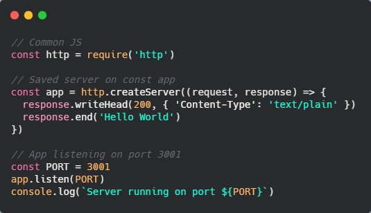
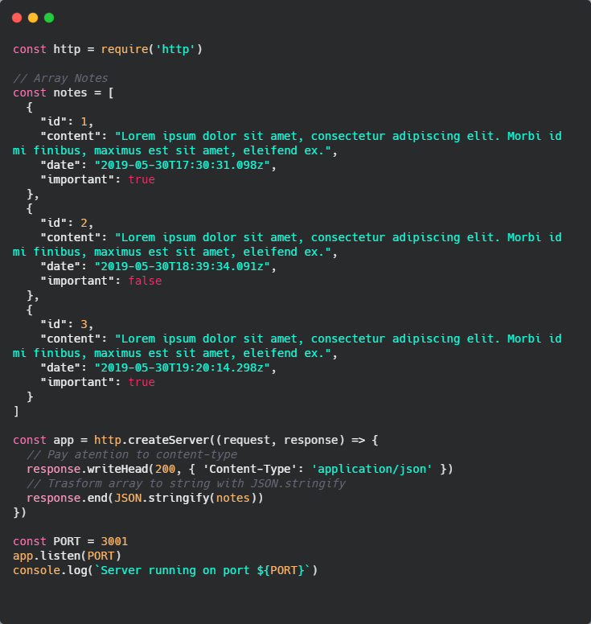
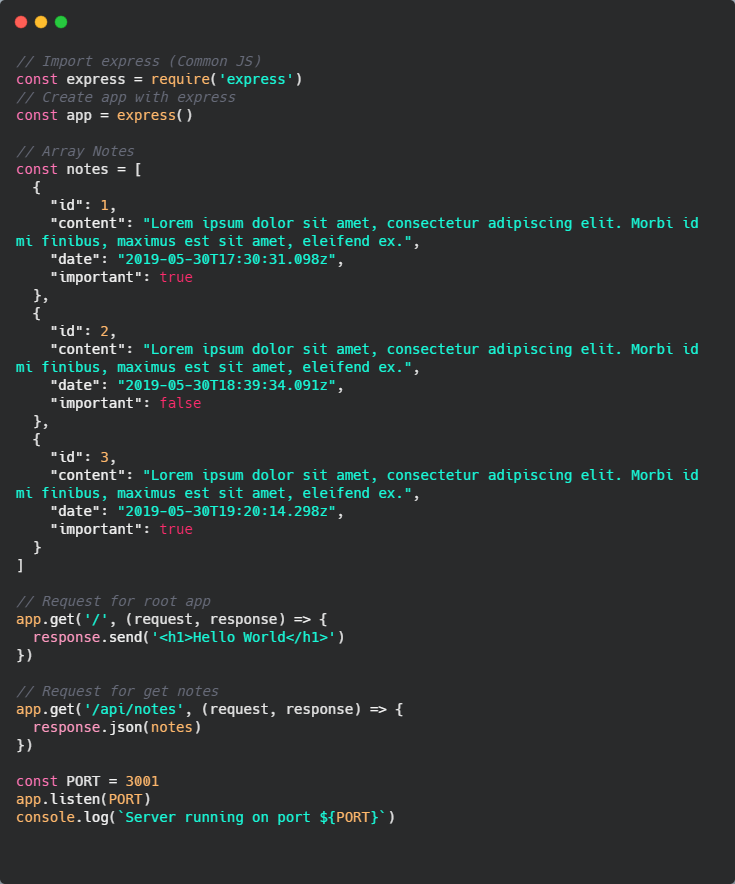
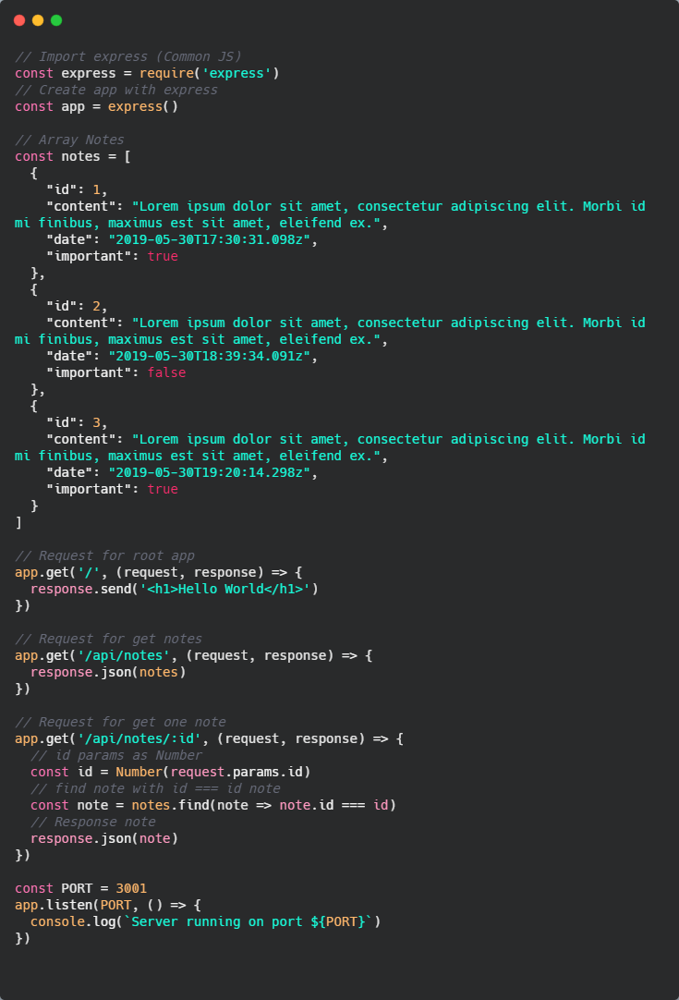
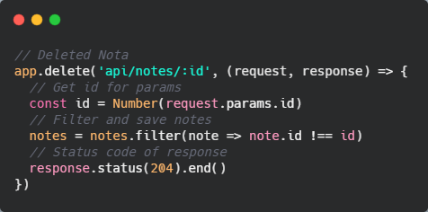
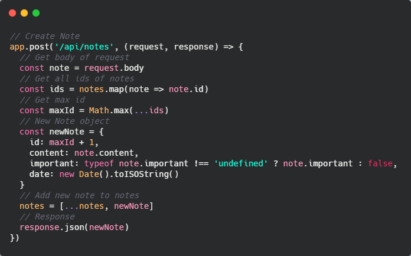

# ☘ Node JS

Crearemos la api de notas de venimos utilizando a lo largo del curso, crearemos un servidor con express y haremos el deploy de nuestra api con heroku.

Para utilizar Node lo primero que debemos tener es Node instalado, como se comentó antes en el curso.

Podemos comezar a "jugar" con Node ejecutando `node` en nuestra consola, esto nos abre un *REPL* (Read Evaluate Print and Loop) y allí tendremos la posibilidad de ejecutar código JS. Esto es para ver si está funcionando todo bien con Node.

Otra cosa que debemos tener instalado es **npm** (Node package Manage), usualmente viene instalada con node ya que es el manejador oficial de paquetes de Node.

Podemos ver las versiones que tenemos instadas de ambas con:

* `node -v`
* `npm -v`

Para iniciar un proyecto en node nos paramos en la carpeta que lo queremos crear y ejecutamos `npm init`. Esto nos inicia, en la carpeta donde estamos un proyecto y nos hará varias preguntas, como, el *nombre del paquete*, *versión*, *descripción*, *punto de entrada*, etc.

Como normalmente dejamos las opciones de npm por defecto, lo que podemos hacer es ejecutar el comando `npm init -y` y eso nos crea el proyecto sin hacernos ninguna pregunta, con las opciones por defecto. En caso de que no nos guste algunas de las opciones podremos cambiarla en el file `package.json`, este archivo tendrá la configuración de nuestro proyecto.

## 👋 Hello World desde Node

Crearemos un archivo `index.js` en la raíz del proyecto y pondremos un `console.log('Hello world!')` y lo guardamos. Luego, en consola, para ejecutar un archivo desde node ponemos el comando `node index.js` y en la consola deberíamos ver nuestro mensaje.

Ahora, es importante, para los proyectos con node, tener lo que se llaman, *scripts* preparados para no tener que estar tipeando el mismo comando siempre. Para configurar los scripts, vamos al archivo `package.json` y veremos que hay una parte que dice `"scripts"`, dentro de ese objeto podremos configurar nuestros scripts. Crearemos uno, llamado **start** y le daremos como valor `node index.js`.

Para saber que scripts tenemos configurados podemos ejecutar `npm run` en consola, y veremos el listado de scripts que tenemos en nuestro proyecto. Así que actualmente, ejecutando `npm start` en consola, también nos dará el mensaje de nuestro *console.log()*.

## ⏱ Primer Servidor con Node

Comenzaremos a crear nuestra **API** (Application Programing Interface), ellas nos permiten, a travez de endpoints, recuperar, crear, guardar, actualizar borrar recursos, es una interfaz con la que nos podemos comunicar para realizar diferentes acciones.



Si ponemos ese código dentro de nuestro archivo `index.js` y ejecutamos `npm start` en la consola, nos imprimirá '*Server running on port 3001*'. Y si abrimos en nuestro navegador y ponemos la dirección `http://localhost:3001` veremos que nos imprime '*Hello World*'.

Con eso vemos que hemos levantado algún tipo de servicio en el puerto `3001`. **localhost** es una forma de nombrar a nuestra máquina dentro del contexto del sistema de red que hay donde nos encontremos (casa, trabajo, etc). localhost es lo mismo que utilizar `127.0.0.1:3001`, con localhost lo hacemos más 'legible'.

Analizando el código vemos que, en la primera línea vemos una forma de importar un módulo distinta a la que veníamos manejando. La línea uno es algo *similar* a decir esto `import http from 'http'` pero de otra forma. La forma que estamos utilizando se denomina **common JS** y la que veníamos viendo se denomina *ECMAScripts Module*, son dos formas de cargar módulos, diferentes. *Common JS* son un tipo de módulos que creó NodeJS ya que no existían los ECMAScripts Modules, pero actualmente Node JS ya soporta los ECMAScripts Modules, así que ya los podríamos utilizar, pero, en la moyoría de los proyectos aún se sigue utilizando common JS por ende nosotros utilizaremos esa forma de importar módulos. Lo importante aquí es que estamos requiriendo un módulo llamado *http* que es un módulo nativo de Node.

Con este módulo vamos a crear un servidor que guardaremos en la constante `app`. Al `createServer` le debemos un parámetro, este parámetro será un **callback**, en este caso, el callback es una función que se ejecutará cada vez que le llegue una petición al servidor. En el primer parámetro recibimos información de la *request* y en el segundo recibé la *response*. La *response* tiene diferentes métodos para que podamos devolver la información que queremos. En este caso, estamos escribiendo el head con `writeHead`, este será la cabecera de la respuesta y nos dice que tiene un status code *200* (significa que está todo bien) y tiene una cabecera que tiene un *content-type* de tipo *texto plano*. Por último para terminar la respuesta devolvemos un *Hello World*.

El servidor que creamos tiene que escuchar en algún puerto, normalmente, cuando entramos a una página web el puerto que escuchamos es el *80* si entramos en una web son `http` o el puerto *443* si entramos en una web con *SSL* `https`, en este caso, le decimos que este servidor va a estar escuchando en el puerto *3001*, puede ser cualquier puerto, lo **importante** es que sea un **puerto** que esté **libre**. Para terminar hacemos un `console.log()` para informarle al usuario en que puerto está escuchando el servidor.

Siguiendo con el ejemplo que venimos trabajando, recordemos, que teníamos una lista de notas que era un array de tres objetos (notas). Podríamos poner nuestro array de notas y devolverlo en la respuesta de la nota, pero no lo podemos utilizar así como array, sino que devemos devolverlo como un string y esto lo hacemos con `JSON.stringify(notes)`, esto recupera el array, lo recorre y transforma a todos los objetos en un string.

Esto funcionaría pero debemos decirle al servidor que tipo de contenido le estamos enviando, en este caso es `application/json` y no `text/plain` como le estabamos enviando.



En caso de tener abierto nuestro servidor debemos cerrarlo y ejecutar nuevamente `npm start`, de esta manera en el puerto 3001 deberímamos ver nuestro array de notas.

Es importante poner bien el content-type así el navegador entiende que es lo que queremos devolver y así el navegador lo parsea de la manera correcta.

## 🧶 Nodemon

Hasta este momento cada vez que hacíamos un cambio en nuestro código debíamos cerrar y abrir la ejecución del mismo para que refrezque los cambios.

PAra evitar esto tenemos a **nodemon**, este es una herramienta que nos permite resetear el servidor cada vez que detecta un cambio en el mismo. Como recomendación es mejor instalarlo en cada proyecto que lo utilizamos y no de manera global, para esto ejecutamos `npm install nodemon -D` y se instalará como dependencia de desarrollo.

Existen dos tipos de dependencia en nuestro proyecto:

* **Dependencias de producción**: Son las dependencias que necesita nuestro proyecto para funcionar, que sin ellas nuestro proyecto no funcionaría
* **Dependencias de desarrollo**: Son las que utilizamos solamente para desarrollar, ej, nodemon, linter, etc.

Para utilizar nodemon crearemos un script, en el archivo `package.json`, llamado `"dev"` que tendrá como valor `nodemon index.js`, como podemos deducir, el archivo package.json accede directamente a los módulos de node (node_modules) y por ende no necesita que le indiquemos la ruta en la que está el módulo, solo con su nombre alcanza, en este caso es el nombre del módulo seguido del archivo que va a estar mirando. Así que ahora si ejecutamos `npm run dev` y ya nos levanta el entorno con nodemon.

## 💫 Semantic versioning en dependencias de npm

Cada vez que hacemos un `npm install`, en el `packaje.json` queda guardada la dependencia, para que la siguiente vez que hagamos `npm install` de todo el proyecto, se leerán de allí las dependencias y sabrá cual tiene que instalar y cual no.

Debemos tener en cuenta una cosa para los proyectos de Node. Si observamos cada dependencia del proyecto tiene se versión (marcada con números). Las versiones utilizadas en NodeJS se denominan **Semantic Versioning**, esto quiere decir, que cada número tiene, semánticamente, un significado. 

Supongamos esta versión de nodemon `"^2.0.7"`:

* **7**: Es el **patch** de la versión, también conocido como **hotfix**, si este número sube, significa que ha hecho algún tipo de cambio en el paquete que lo que arregla es un *bug* o problema que tenía el paquete. No tiene ninguna feature nueva ni cambia funcionalidad, simplemente arregla algo.

* **0**: Esta es la **minor** de la versión, si este número sube, quiere decir que se agregó una nueva *feature*, por ej, si nodemon además de leer los cambios que se hacen en los files también recargara el navegador automáticamente, eso subiría este número en uno.

* **2**: Esta es la **major** de la versión, si cambia este número, cambia la versión del paquete y cambia el contrato con el que se rige el mismo, por ejemplo, un vez de llamarlo de esta manera `nodemon index.js` podría cambiar y comenzar a llamarse así `nodemon --file index.js`, esto rompe la compatibilidad con versiones anteriores.

* **^**: Su nombre oficial es **caret**, esto nos indica que hasta cierto punto, esta dependencia se actualizará automáticamente. Si surgen versiones nuevas, el paquete se actualizará, lo que no hará es actualizar el *major*, ya que podría romper nuestra aplicación, pero el *patch* y el *minor* si que los actualizará. Sólo en caso de tener una versión *0* de un paquete no nos subirá la *minor* y sólo nos actualizará el *patch*. Esto es un poco complejo ya que no tenemos control de versión que estamos instalando.

Como recomendación para cuando estamos iniciando con NodeJS quitar el *caret* o instalar los paquetes con `npm install packajeName -E`, esto nos instala la versión exacta del paquete que vamos a instalar. Es importante controlar cuando vamos a instalar una actualización de una dependencia.

## 🏃‍♂️ Express

Si volvemos a nuestra aplicación, vemos que nos devuelve las notas, pero si queremos entrar a cualquier url que tenga como padre nuestro `http://localhost:3001`, por ejemplo `http://localhost:3001/jfdfsnjnfds`, nos seguirá devolviendo las notas, este tipo de cosas las queremos controlar, podríamos hacer con Node, leyendo lo que nos manda el request, etc, pero esto termina siendo tedioso, para manejar Node de una mejor manera es que está **Express**.

Express nos permite crear un servidor que va a tener diferentes rutas, de forma que podemos manejar que rutas hacen que cosa, también tiene middlewares y nos simplificará muchísimo nuestro código, para instalar ejecutamos `npm install express`, como vemos la instalamos como una dependencia de producción, ya que express será vital para que nuestra aplicación se ejecute de buena manera.

Importaremos este módulo y dejaremos de usar el módulo http, para comenzar a utilizar express.

Luego crearemos la aplicación pero esta vez será con express, crearemos una constante `app` y allí ejecutamos `express()`.

A la app le podemos indicar, cuando se realiza una acción que tiene que hacer, por ej, si se hace una petición de tipo get que es lo que tiene que hacer. Esta acción recibe dos parámetros, la *url* donde tiene que actuar y el *callback* que será una función que tendrá los dos parámetros que vimos antes (*request* y *response*). En el callback le diremos que es lo que hace la aplicación cuando entra al path que le indicamos, en este caso devolveremos un `<h1>Hello World</h1>`.

Podemos crear otra ruta para las notas, entonces, le decimos que cuando entre a la ruta `/api/notes` nos devuelva las notas. Si vemos el código observamos que no necesitamos pasarle las notas dentro de un `JSON.stringify`, esto express lo hace por nosotros y si le indicamos `response.json()` el ya sabrá que lo que le estamos pasando es un json.



Si comparamos el código con express y el de node vemos que hay mucho código que nos estamos ahorrando, por ej, no debemos pasarle content-type ni status code, eso lo hace express por nosotros, ahora ya tenemos también las url validadas y solo nos renderiza algo si entramos a las url que tenemos definidas.

Debemos hacer un último cambio y es que la forma de decirla que escuche el servidor a express es un poco distinto que Node, cuando le decimos que escuche, este recibe dos parámetros, *el puerto* y un *callback* ya que es un método asíncrono. Así que nos quedaría así la última parte del código

```
const PORT = 3001

app.listen(PORT, () => {
  console.log(`Server running on port ${PORT}`)
})
```

Lo que haremos, entonces, es una API Rest. Rest es un tipo de arquitectura nos permite construir APIS escalables, esto quiere decir que, cada recurso tiene una dirección única a la que dirigirte, por ej, si queremos notas `/api/notes` sería su **dirección única**, lo que diferencia el como se trata ese recurso es la acción que aplicamos, por ej, *.get()*, *.post()*, *.put()*, *.delete()*, o sea, tenemos diferentes acciones a hacer sobre la misma dirección.

Sabiendo esto, crearemos un path que nos devuelva una sola nota, para esto en el path pasaremos un parámetro dinámico que será el id de la nota y lo haremos de esta manera `/api/notes/:id`. Esa es la forma dinámica de recuperar un segmento del path y le decimos que ese segmento lo capturamos con el name `id`. Enotonces, podremos recuperar la id que nos llega mediante la `request.params.id` y guardarlo en una variable.

Para devolver la nota que recibimos por parámetro debemos buscar en nuestro array de notas el id que coincida con el id que nos llega por parámetro y así devolver la nota que nos piden. Recordar transformar el id que nos llega por parámetro a un tipo de dato *Number* ya que sino cuando comparemos los tipos de dato serán distintos y no nos devolverá nada.



Podríamos, también, hacer una validación para que la respuesta devuelva un status code de *200* si todo salió bien pero en caso de que no sea lo que esperamos, podríamos devolver una respuestas con un status code *404*, dentro de nuestro `get` haríamos lo siguiente

```
if (note) {
  response.json(note)
} else {
  response.status(404).end()
}
```

Como dijimos, otra acción que podemos utilizar es `.delete()`, utilizando la misma ruta del recurso y recibiendo el id como params. Una vez capturado el *id* lo que debemos es filtrar nuestro array de notas para recuperar todas las notas excepto la nota que nuestro id coincida. En este caso el status code que devolvemos es el `204` que se utiliza para cuando alguna cosa no tiene contenido, lo cual tiene lógica ya que una vez borrado ese contenido de la nota no existirá más.



## 💥 Herramientas para probar nuestra api

Existen varias herramientas para probar nuestra api, *Postman*, **Insomnia**, en este curso utilizamos esta última, ya que Postman tiene muchas funcionalidades que en este momento no necesitamos.

Una vez nos la descargamos, vamos a añadir una nueva request agregamos la url que queremos utilizar y le indicamos la acción, luego *Create*.

Al darle a *send* hace la petición y nos imprime la respuesta. Podemos jugar y poner todas las acciones que tenemos en nuestro código para probar también que nuestra api está funcionando.

Algo importante a recordar es que estas acciones no tendrán persistencia, solo persiste en memoria pero cada vez que reiniciamos el servidor, vuelven a estar las mismas notas de nuestro array que teníamos desde un principio.

Otra herramienta que podríamos utilizar es una que nos ofrece el propio editor VS, una extensión, llamada **REST Client**, que nos permite hacer peticiones y verlas en el mismo editor. Esto lo hcemos creando archivos.

Para hacer un get de todas las notas, deberíamos crear un archivo llamado, por ejemplo, `get_all_notes.rest` y dentro poner lo siguiente

```
GET http://localhost:3001/api/notes
```

Arriba de ese código nos debería aparecer un `Send Request` al que si le damos click nos abrirá una pestaña de VS con la respuesta de nuestra api. Podríamos crear la petición para delete y para obtener una sola nota.

## ✅ Crear un recurso con POST

La acción `.post()` nos permite crear un recurso en la dirección que le pasemos. Para enviar información en una request, debemos pasarle un objeto, ese objeto debería ser muy parecido al objeto que tenemos con cada nota.

Si miramos el objeto de cada nota vemos que, la *id* la debemos generar, no se la debe pasar el usuario que la crea, el *content* si debemos pasarselo a la request, el *date* no se lo debe pasar, porque debe ser la fecha de creación del contenido y por último, el *important* que se lo pasamos pero va a ser un valor opcional.

Es importante saber que mientras menos valores le pasemos a la request mejor.

Desde las últimas versiones de express, tenemos un paquete que viene con el módulo, que nos facilitará el manejo para enviar datos a la petición, ya que de manera nativa se hace un poco complicado el manejo. El paquete se llama **body-parser** y lo que hace es devolvernos en la request.body lo que nosotros le estamos enviando a travéz del objeto en la petición para crear el recurso. Para utilizarlo debemos indicarle a la aplicación que utilice el paquete y lo hacemos con `app.use(express.json())`.

A la hora de crear un recurso es muy importante indicarle el tipo de contenido que tendrá nuestro recurso, sino no se creará correctamente.

Si utilizamos *REST Client* para hacer la petición la heríamos de la siguiente manera

```
POST http://localhost:3001/api/notes
Content-Type: application/json

{
  "content": "Esto es una nueva nota"
}
```

Una vez que probamos que esto funcione, pasaremos a hacer el código para crear la nueva nota, ya que como dijimos debemos armar el objeto con todas sus propiedades. El `id` lo generamos observando todas las notas y obteniendo cual es la id máxima que tienen las notas a ese número le sumaremos uno y ahí tendremos el nueva id. El `content` vendrá del contenido de la nota. El `important` lo sacaremos del *important* de la nota y haremos una validación ya que no es un valor obligatorio, en caso de su valor no exista lo seteamos como `false`. Por último la fecha que lo obtenemos con `new Date().toISOString()`.

Una vez tengamos el objeto lo añadimos a las notas con spread operator y le pasamos la nueva nota creada. Una vez hecho esto, en la respuesta, devolvemos la nota creada.



Si probamos ahora hacer una petición para crear una nota, deberíamos poder crearla y como respuesta deberíamos recibir el nuevo objeto creado. Se obtenemos todas las notas nos debería entregar todas ellas incluso las que creamos actualmente.

Lo que queremos es que el content de la nota si que sea obligatorio, así que, podemos crear una validación para que cuando no nos envían contenido dar un mensaje de error al usuario y decirle que el contenido es requerido, incluso cambiar el status code a un 400 (significa, contenido no creado).

## ⚡ ESlint

Queremos que nuestro código tenga la menor cantidad de errores posible, para esto utilizamos herremientas llamada **linters**, lo que hacen es detectar y señalar los errores que tiene un lenguaje de programación, en este caso JavaScript. No solo maneja errores sino que también nos indica cosas de code styling, que estilo de código utilizamos, por ej, si estamos utilizando dos espacios y el proyecto debería ser con 4 espacios, si utilizamos *;* y el proyecto no lo utiliza, etc. nos ayuda a que todo un equipo siga una misma lógica de diseño de código.

El *linter* más utilizado es **ESlint** y lo instalamos con `npm install eslint -D`. Para iniciar con el ejecutamos en consola `./node_modules/.bin/eslint --init` y eso nos permite inicializar la cnfiguración de nuestro eslint. Nos hará preguntas tales como el estilo de código que utilizaremos, de que tipo derá nuestra importación de módulos, si nuestro proyecto utiliza algún framework, si tenemos TypeScript, donde correremos nuestro proyecto, por últtimo unas preguntas del estilo, nos pregunta si queremos una configuración popular de estilo o la queremos presonalizar. Al final de esto nos crea el archivo `.eslintrc.js` con toda la config de nuestro linter.

Si entramos a nuestro `index.js` veremos que nos muestra un montón de errores en nuestro código debido a la configuración que tenemos en nuestro eslint. Para ver estos errores debemos tener instalado una extensión de VS llamada **EsLint**, esta lee nuestra configuración de ESLint y nos marca los errores que cometemos en nuestro código. Los errores los podemos detectar en el código o en consola con `./node_modules/.bin/eslint .` y nos imprime por consola los errores que tenemos en el código. Podemos crear un nuevo script en nuestro `package.json` que sea `lint` con el valor `eslint .` y así, si ejecutamos `npm run lint` nos dirá por consola cuales son los errores de nuestro código.

Este ESLint lo podemos usar para configurar nuestro linter como nosotros queramos, pero, hay otras herramientas como *airbnb linter* y **standard linter** que ya nos vienen con un montón de reglas preconfiguradas y este último está basado en no utilizar simicolons además de que utiliza *ESLint*, así que es este el que usaremos en el proyecto.

Para utilizar *Satandard* en nuestro proyecto lo instalamos con `npm install standard -D`, una vez instalado, no tenemos que hacer un archivo de configuración para el linter sino que en el package.json le indicamos, a travéz, del objeto `"eslintConfig"`, que queremos extender la configuración desde standard y lo hacemos con `"extends": "./node_modulers/standard/eslintrc.json"`. Esta configuración tiene varios detalles más de los que podemos crear a mano nosotros pasandole una configuración propia.

## ⭐ Middlewares en Express

Un **middleware** es una función que intercepta la petición que está pasando por nuestra api, por ejemplo, cuando a nuestra app le decimos que use algún tipo de cosa, lo que le pasamos dentro es un *middleware*, por ejemplo, esto es un middleware `app.use(express.json())`, en caso de que nosotros creemos uno, este además de recibir la `request` y la `response`, como en los demás, también recibe un terce parámetro que es el `next`, este le dice al middleware que una vez termina de ejecutar siga con lo que sigue de nuestra aplicación

```
app.use((request, response, next) => {
  console.log(request.method)
  console.log(request.path)
  console.loh(request.body)
  console.log('--------')
  next()
})
```

Si no le pasamos el next, la aplicación se quedará esperando y no ejecutará el resto de nuestro código.

Podríamos crear un middleware para el `404` ya que no estamos controlando que pasa cuando un usuario ingresa a nuestra url de forma incorrecta. Para esto creamos un middleware, le pasamos en que status se ejecutará y como respuesta le damos un json que diga cual es el error.

```
app.use((request, response) => {
  response.status(404).json({
    error: 'Not Found'
  })
})
```

## 🚧 CORS con Express

Si queremos probar nuestra api en algún sitio, como el de las notas que venimos creando antes, veremos que en consola nos tira un error como que no podemos acceder desde un orígen distinto al de nuestra api ya que el CORS no nos deja. Pero, que quiere decir esto, quiere decir que no nos dejará acceder a nuestra api, a menos que quiéramos acceder desde la misma url `http://localhost:3001`.

No queremos que nos pase esto, ya que queremos que se pueda acceder a nustra api desde donde queramos. Como nosotros tenemos acceso al backend de nuestra aplicación podremos dar permiso para que nuestra app se utilice desde cualquier dominio, para esto tenemos un middleware en express, llamado `cors`, lo instalamos con `npm install cors` lo importamos y lo utilizamos en nuestra app.

```
const cors = require('cors)

app.use(cors())
```

Con esto hacemos que nuestra api funcione con cualquier orígen. Podríamos configurar el middleware y pasarle una configuración particular.

## ♓ Deploy con Heroku

Haremos deploy de nuestro backend con heroku. Para esto, lo primero que hacemos es crear un archivo, en el root de nuestra app, llamado `Procfile` y dentro le pasaremos nuestra configuración, le decimos que tipo de recurso vamos a deployar, en este caso es un servicio web y como valor le pasamos el comando que debe ejecutar para correr nuestro proyecto, en nuestro caso `npm start`.

Debemos bajarnos el *CLI* de heroku y crearnos una cuenta para poder utilizarlo.

Antes de continuar, debemos cambiar el puerto por el cual va a correr nuestra aplicación, no puede ser estático, ya que heroku lo correrá en el puerto que ellos digan, entonces cambiaremos nuestra variable del puerto para que lo obtenga a travéz de la variable de entorno PORT `const PORT = process.env.PORT || 3001`, en caso de que no lo obtenga si lo correrá en el puerto 3001.

Ahora crearemos la palicación con `heroku create`, con eso heroku nos crea un orígen para que podemos pushear nuestros archivos a un repo de heroku, una vez tengamos todos los archivos pusheados a nuestro repositorio es que vamos a hacer un `git push heroku branchName` y esto nos enviará todos nuestros archivos al repositorio de nuestra página en *heroku* y nos dirá en consola la url en la que se creó nuestra app.

Ahora podríamos llamar a nuestra api desde cualquier app, y consultar sus datos, obteniéndolos y actualizando los datos.
