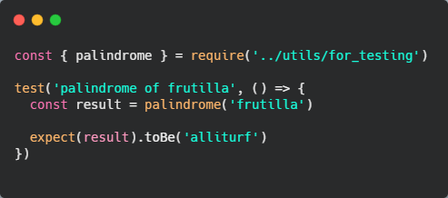
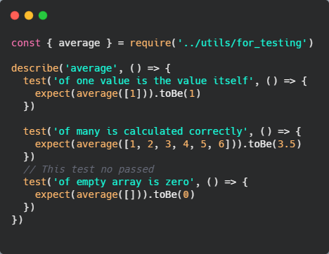
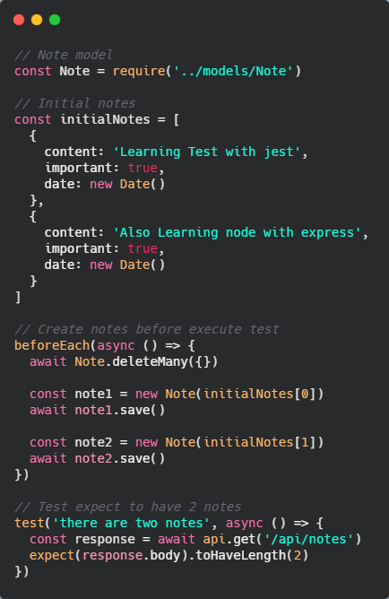
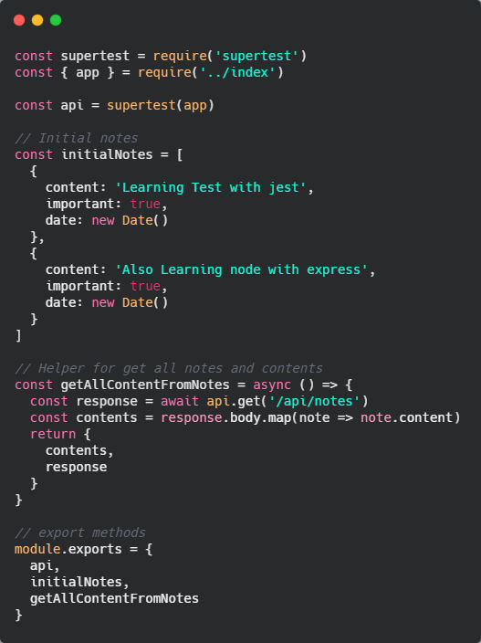

# 🧪 Testing con Jest

Usamos el testing para evaluar que la funcionalidad de nuestra app sea la correcta. Comenzaremos con el testing de nuestro backend(API de notas).

Introducimos los test con nuestro *console method* `assert`. Este recibe dos parámetros, el primero, es la lógica a evaluar y el segundo es lo que voy a mostrar cuando ocurra el error.

```
const suma = (a, b) => {
  return a - b
}

console.assert(
  suma(1, 3) === 4,
  'Suma of 1 and 3 expected to be 4'
)
```

Si ejecutamos esto en consola nos dirá que `Assertion failed: Suma of 1 and 3 expected to be 4`. Es interesante utilizar este `console.assert()` para hacer este tipo de asserciones, las aserciones nos sirven para evaluar algo que tenemos y esperamos que nos de un resultado en concreto.

Para probar otros ejemplos podríamos también refactorizar nuestro código y hacer una variable `checks` que tenga distintos objetos para checkear distintos resultados.

```
const suma = (a, b) => {
  return a - b
}

const checks = [
  { a: 0, b: 0, result: 0 },
  { a: 1, b: 3, result: 4 },
  { a: -3, b: 3, result: 0 }
]

checks.forEach(check => {
  const { a, b, result } = check

  console.assert(
    suma(a, b) === result,
    `Suma of ${a} and ${b} expected to be ${result}`
  )
})
```

Esto nos diría cual de estas acersiones pasó y cual no. Esta herramienta nos sirve como para revisar código simple, pero obviamente no vamos a estar haciendo los test de esta manera.

Crearemos dos métodos de ejemplo para evaluar luego en testing, `palindrome` (nos devuelve si un string dado es un palíndromo) y `average` (nos devuelve la differencia de un array de números dado).

```
const palindrome = string => {
  return string
    .split('')
    .reverse()
    .join('')
}

const average = array => {
  let sum = 0
  array.forEach(num => { sum += num })
  return sum / array.length
}

module.exports = {
  palindrome,
  average
}
```

Pasaremos a crear los test para evaluar si estas funciones devuelven lo que deberían. Para evaluar esto podemos utilizar varias herramientas que nos facilitan el hacer test. Una de ella es *Mocha* que es un framework para hacer testing que ya viene con muchas utilidades resueltas, es una de las más utilizadas pero seguramente actualmente está en desuso, seguramente hay muchos proyectos hechos con ella pero actualmente fue destronada. Otra opción que tenemos es *AVA* también es un test runner que se caracteriza por ser muy rápido el cual es bueno saber que existe e investigar para el futuro. Finalmente tenemos a **Jest** que es un framework para hacer testing desarrollado por facebook, aunque en un principio estaba pensado para hacer testing solo del lado del cliente, ha evolucionado y lo podemos utilizar sin problemas en el servidor, así que utilizaremos *Jest*.

Comenzamos instalando Jest con `npm i jest -D`, importante es que será una dependencia de desarrollo ya que lo utilizamos para test.

Cosas a tener en cuenta al utilizar jest:
  * En windows tiene un problema y es que si alguna de las carpetas de las que utilizamos el proyecto, tiene espacios, este puede no funcionar correctamente.
  * Por defecto jest está pensado para trabajar en el cliente, así que, debemos configurar en nuestro `package.json` y le decimos que el entorno en el que vamos a estar trabajando es node.
  * Para que nuestro linter detecte nuestro código y no nos marque errores debemos configurar en nuestro `package.json` en la parte de la configuración del linter que sepa que estamos utilizando jest

Teniendo en cuenta estos puntos comenzamos creando nuestro primer test. Jest lo que hace es buscar todos los archivos que tengan el `.test.js` así que creamos un test llamado `palindrome.test.js` y allí generamos nuestro test. 

No será necesario importar jest ya que como dijimos jest ejecutará los archivo con la nomenclatura marcada. Lo que si debemos importar es nuestro método `palindrome` creado anteriormente.

Luego de importar escribiremos nuestro test y lo hacemos con el método `test()`, el cual recibe dos parámetros, la descripción del test y lo que hará ese test.

Dentro del método test guardamos el resultado de nuestro palíndromo y luego con el método `expect()` le decimos el resultado que esperamos que tenga y lo encadenamos al método `toBe()` y le decimos como es el string que debemos recibir.



Para ejecutar este código creamos un script `test` en el `package.json` así solamente haciendo la ejecución de `npm run test` ya ejecutamos nuestros test. Así que, si ejecutamos ese script nuestro test debería pasar correctamente.

Esto está bien pero no tanto, lo mejor es siempre hacer primero que el test falle y luego probar si funciona, debemos hacer fallar nuestro test al menos una vez.

Es bueno recordar que los test no solo nos servirán para testar que nuestra app haga lo que nosotros queremos sino que también nos sirve como documentación, ya que si una persona que lee nuestro código no entiende bien que es lo que hace una funcion puede ir a nuestros test y ver que es lo que se espera que estos hagan.

Para hacer los test del método `average` no utilizamos `test()` ya que este nos dice uno por uno los test si pasan o no y se puede hacer un poco difícil de leer, una mejor forma de hacer test es agrupándolos, esto lo hacemos con el método `describe()` que es una forma de describir un contexto o una situación en común que tienen los test que vamos a utilizar.

En este caso lo describimos con `average` y le pasamos un callback para ejecutar los test.



Como vemos el último test no pasaría ya que nuestro método average no está preparado para recibir un array vacío, podríamos hacer el condicional para cuando existe este caso y así poder pasar el test.

## 🔍 Testing de nuestro Backend

Antes de comenzar con los test debemos indicarle a nuestra aplicación en que entorno se está ejecutando, en node podemos tener varios entornos de ejecución y dependiendo en que entorno nos encontremos es que tipo de información vamos a tener disponible. 

Esto se lo indicamos en los scripts de nuestro `package.json` con `NODE_ENV={environment}`. Es importante saber que en windows esto no funciona de manera correcta. Para que esto funcione debemos instalar la dependencia `npm i cross-env` y pondremos la sentencia `cross-env` entes de decalrar nuestras variables de entorno.

Para comenzar a trabajar con nuestro backend debemos crear una base de datos para el test ya que NO debemos manipular la base de datos de desarrollo y mucho menos la de producción para hacer test. En nuestro archivo `.env` debemos crear nuestra *URI* para la base de datos test, en lugar de tener `app_notes_db` debemos tener `app_notes_db_test` así que nuestra `MONGO_DB_URI_TEST` quedará de la siguiente manera `mongodb+srv://db_user_notes:<password>@cluster0.5v65t.mongodb.net/app_notes_db_test?retryWrites=true&w=majority`.

Ahora debemos cambiar nuestro código en el llamado a la URI para que cuando nos conectemos a la base y estemos usando **test** utilicemos la base de datos que acabamos de crear.

```
const { MONGO_DB_URI, MONGO_DB_URI_TEST, NODE_ENV } = process.env

const connectionString = NODE_ENV === 'test'
  ? MONGO_DB_URI_TEST
  : MONGO_DB_URI
```

La pregunta que nos debemos hacer ahora es ¿Qué vamos a testar?, si miramos nuestro archivo `index.js` tenemos varios middlewares, pero si vemos, ya no nos sirve hacer test unitarios que definan algo concreto, sino que podemos hacer **test de integración**, esto quiere decir que integran más de una cosa, incluso podemos decir que serán test e2e, ya que integran la base de datos. Lo que más nos interesa testear son los endpoints.

## 🚀 Supertest

Para testear endpoints utilizaremos una herramienta que nos permite probar fácilmente servidores `http` que es nuestro caso. Lo instalamos con `npm i supertest -D`.

Una vez lo tenemos instalado, comenzamos a hacer nuestro primer test. Crearemos el test para nuestro primer endpoint que es para obtener todas las notas. Importante, en nuestro archivo `index.js` exportar nuestra app para poder utilizarla en los test.

```
const supertest = require('supertest')
const app = require('../index')

const api = supertest(app)

test('notes are returned as json', () => {
  api
    .get('/api/notes')
    .expect(200)
    .expect('Content-Type', /application\/json/)
})
```

Como se ve en el código, estamos importanto la librería `supertest` y nuestra `app`, luego le asignamos nuestra *app* a *supertest* y lo guardamos en una variable para finalmente, a travéz de la variable creada ejecutar nuestros test.

Le decimos que esperamos devuelva un status code de `200` y que el formato es un JSON.

Hasta ahí todo bien, pero, si ejecutamos el test vemos que pasa el test pero da errores incluso si queremos forzar el error, el test pasaría sin problemas, esto quiere decir que nuestro test está mal.

Las fallas se dan porque todos los métodos que puede recibir la api son asíncronos, esto quiere decir que en este momento se estan ejecutando antes de esperar una respuesta.

```
const supertest = require('supertest')
const app = require('../index')

const api = supertest(app)

test('notes are returned as json', async () => {
  await api
    .get('/api/notes')
    .expect(200)
    .expect('Content-Type', /application\/json/)
})
```

De esta manera, debería estar funcionando nuestro test, tanto para éxito como para el error. Si vemos la consola vemos que tenemos algunos `console.log`, podemos hacer que esto no lo imprima cuando hace un test y eso se lo pasamos como parámetro al script del test con `--silent`, hay veces que está bien que lo quitemos y hay veces que lo vamos a necesitar.

Si vemos la consola nos marca otro error que dice que dejamos alguna conexión abierta en algún lugar y que ejecutemos `--detectOpenHandles`, así que lo agregamos a nuestro script y ejecutamos el mismo.

Lo que nos dice ahora es que ha ejecutado el test pero detectó que la conexión con el servidor no la cerramos, esto está ocurriendo en nuestro `listen` en el `index.js`, así que debemos cerrar la conexión. Guardaremos nuestra conexión con el server en una variable `server` para luego exportarla y así poder usarla en nuestro `notes.test.js`.

Ahora la importamos en nuestro archivo de test. Para cerrar el servidor utilizaremos uno de los hooks, los hooks son ganchos que se ejecutan en diferentes fases de nuestros test, uno de ellos es el hook `afterAll()` que recibe un callback que se ejecuta una vez que terminen todos los test

```
afterAll(() => {
  server.close()
})
```

Otra conexión que debemos cerrar es con la base de datos, así que importamos la librería de mongoose y dentro del hook ejecutamos `mongoose.connection.close()`.

Ahora quitaremos el `--detectOpenHandles` y agregaremos un nuevo script para que el test esté contínuamente esuchando los cambios y no tengamos que cerrar y abrir cada vez que realizamos un cambio. El nuevo script lo creamos en nuestro `package.json` con `"test:watch": "npm run test -- --watch"`, los dos guiones antes del parámetro `--watch` son para que el parámetro se lo aplique al nuevo script que estamos utilizando y no al script de test.

Si tenemos algún test que queremos saltarlo por algún motivo particular, lo que hacemos es al método `describe` le concatenamos el métedo `skip`, nos quedaría `describe.skip('test', () => {})`. Nos indicará en consola la cantidad de test que estamos skipeando.

## 🚧 Creando nuevos test

Ya tenemos nuestro primer test para evaluar si lo que nos devuelve nuestra api es un status correcto y el tipo de contenido que queremos, ahora queremos saber si nos devuelve notas.

Lo que queremos ahora es ver la respuesta que tiene la api, con esa respuesta lo que esperamos es que con el cuerpo de la respuesta ver si tenemos una longitud de dos notas, para saber la longitud de un array utilizamos el método `toHaveLength()`.

Lo importante es que los test sean *predecibles*, esto significa que, no importa la cantidad de veces que ejecutemos un test, tiene que dar siempre lo mismo, no debe depender de nada externo, no debe tener **side effects**. Es por esto que tenemos que controlar la cantidad de notas que tendremos, es por esto que estaremos manipulando otra base de datos.

Debemos crear en nuestro archivo de test unas notas iniciales que serán con las que testearemos. Utilizaremos un nuevo hook, para indicar que antes que que realice cualquier test queremos que nuestros notas iniciales esten en la base de datos ya que no queremos depender del último estado en el que quedó nuestra base de datos anteriormente. El hook se denomina `beforeEach` y recibe un callback que le pasaremos nuestro modelo que creamos anteriormente.

Lo primero que hacemos es borrar todas las notas que haya en la base de datos y luego creamos las notas con nuestras notas iniciales. Con esto siempre controlamos que hay dos notas en nuestro array de notas.



Tenemos en el código lo que comentabamos anteriormente, pero este código es muy mejorables, ya que si agregamos más notas en nuestro array podemos tener un prblema, así que en lugar de decir que la cantidad de notas que esperamos son dos, podemos decir que la cantidad va a ser igual a la cantidad de notas que tengamos en nuestro `initialNotes`, lo hacemos con

```
expect(response.body).toHaveLength(initialNotes.length)
```

También podemos cambiar la descripción del test poniendo en template string y que en vez de `two` diga el número con la cantidad de notas que tenemos en nuestro array.

Podemos crear un nuevo test y evaluar el contenido de la primer nota, la haremos de esta manera

```
test('the first note is about learn test', async () => {
  const response = await api.get('/api/notes')
  expect(response.body[0].content).toBe('Learning Test with jest')
})
```

Podríamos no ser tan específicos igualmente, al indicar que la primera nota tenga tal contenido, podríamos evaluar que el contenido que queremos buscar se encuentre en alguna de las notas, eso lo podemos hacer con `toContain()`, este buscará el string que le pasamos dentro de un array

```
test('the some note is about learn test', async () => {
  const response = await api.get('/api/notes')

  const contents = response.body.map(note => note.content)

  expect(contents).toContain('Learning Test with jest')
})
```

Algo que debemos saber es que podemos ejecutar un test en concreto, tanto un archivo de test en concreto como un test en particular de ese archivo, esto lo hacemos mediente el script de test `"test": "cross-env NODE_ENV=test jest --verbose --silent tests/notes.test.js -- -t 'the some note is about learn test'"` con eso leeríamos solo el archivo indicado y ejecutaríamos el test que coincida con ese nombre. El título no hace falta que sea tal cual, alcanza con que coincida al menos una palabra. Nos dice que test está saltanto.

Ahora podemos continuar con el test para el método post

```
test('a valid notee can be added', async () => {
  const newNote = {
    content: 'New Note Added',
    important: false
  }

  await api
    .post('/api/notes')
    .send(newNote)
    .expect(200)
    .expect('Content-Type', /application\/json/)
  
  // check created note
  const response = await api.get('/api/notes')
  const contents = response.body.map(note => note.content)

  expect(response.body).toHaveLength(initialNotes.length + 1)
  expect(contents).toContain(newNote.content)
})
```

Lo primero que hacemos es crear la nota, le pasamos solo el contenido y si es importante o no, ya que los demas datos los genera nuestra api. Luego haremos un post a nuestra api enviándole la nota y le decimos que esperamos nos devuelva un status code 200 y su content type debe ser de tipo json. Para poder checkear si nuestra nota se creó correctamente, hacemos un get a nuestra api y guardamos la respuesta, luego recorremos el contenido de cada nota con un `map()` y lo guardamos en la variable `contents`. Po lógica ahora deberíamos tener una nota más en la db además de las notas iniciales que tenemos, así que por eso le decimos que esperamos que su longitud sea de una más que la longitud de nuestro array de notas iniciales. Por último evaluamos si alguna de las notas que tenemos en nuestra base, su contanido es igual al contenido de la nota que acabamos de crear.

También podemos evaluar que pasa si creamos una nota sin contenido, nuestra api debería fallar

```
test('note without content is not added', async () => {
  const newNote = {
    important: false
  }

  await api
    .post('/api/notes')
    .send(newNote)
    .expect(400)
  
  const response = await api.get('/api/notes')

  expect(response.body).toHaveLength(initialNotes.length)
})
```

Aquí hacemos algo parecido al anterior, con la diferencia que los resultados que esperamos son otros. Primero creamos nuestra nota sin contenido, luego haremos un `post` a nuestra api creando nuestra nota, lo que esperamos es un status code `400` y cuando obtenemos la respuesta esperamos que la longitud de nuestro array de ntas sea igual al de nuestras notas iniciales ya que la nota no se ha podido crear.

## ♻ Refactorizando código

Si miramos el código vemos que estamos repitiendo mucho, es por esto que comenzaremos a refactorizar nuestro código.

*Comenzaremos* con nuestros **test**, haremos una archivo `helpers.js` dentro de la carpeta test. Comenzamos a llevarnos cosas de nuestro `notes.test.js` para allí así nos quedará un código más limpio.



Como se ve con esto nuestro código queda más linpio y podremos reutilizar varios helpers y no estar repitiendo el mismo código.

Continuamos nuestros **middlewares de la api**, como ya tenemos test y vimos que funciona nuestro código, podemos comenzar a refactorizar el mismo. Utilizaremos `async-await` para la refactorización.

Crearemos un test para nuestro método `delete` para luego seguir con la refactorización del mismo.

```
test('a note can be deleted', async () => {
  const { response: firstResponse } = await getAllContentFromNotes()
  const noteToDelete = firstResponse.body[0]
  await api
    .delete(`/api/notes/${noteToDelete.id}`)
    .expect(204)
  
  const { contents, response: secondResponse } = await getAllContentFromNotes()
  expect(secondResponse.body).toHaveLength(initialNotes.length - 1)

  expect(contents).not.toContain(noteToDelete.content)
})
```

Primero obtenemos todas las notas creadas desde nuestro initialNotes, guardamos esa respuesta en una variable, luego capturamos la primera nota , luego ejecutaremos el método `delete` pasandole el id de la nota que capturamos. Lo que esperamos recibir es un status code `204`. Para evaluar si todo ocurrió correctamente podemos hacer dos cosas, la primera que hacemos es evaluar que la longitud de nuestras notas sea igual a la longitud de nuestras notas iniciales menos 1, ya que se supone borramos una nota, la otra opción que tenemos es evaluar que el contenido de la nota que borramos ya no existe dentro de nuestra colección.

Otro test que podemos hacer es el de evaluar que no se puede borrar una nota que no existe

```
test('a note that don\'t exist can\'t be deleted', async () => {
  await api
    .delete('/api/notes/12345')
    .expect(400)
  
  const { response } = await getAllContentFromNotes()
  expect(response.body).toHaveLength(initialNotes.length)
})
```

Pasamos un id que sabemos no existe, esperamos que nos devuelve un status code `400` y esperamos que nuestra longitud de respuesta en el body sea igual a la longitud de nuestras notas iniciales, ya que no se borro ninguna nota.

Ahora podemos refactorizar nuestro método `delete` en nuestro index.

Terminaremos refactorizando nuestro **beforeEach**, tendremos dos formas de refactorizarlos, una *secuancial* y otra en *paralelo*

```
beforeEach(async () => {
  await Note.deleteMany({})
  // parallel
  const notesObject = initialNotes.map(note => new Note(note))
  const promises = notesObject.map(note => note.save())
  await Promise.all(promises)

  // secuential
  for (const note of initialNotes) {
    const notesObject = new Note(note)
    await notesObject.save()
  }
})
```

Para el caso del método en **paralelo**, mapeamos las notas iniciales, por cada nota crearemos una nota y eso lo guardamos en `notesObject`, luego guardamos esas notas en la base de datos y esas notas las guardamos en una variables `promises`, luego para que se guarden en la base de datos debemos ejecutarlo mediante un `Promise.all` que enviará todas nuestras notas a la base de datos, esta forma es la más rápida de agregar notas. La desventaje de este método es que no tenemos control sobre el orden en que se crean las notas, el orden en que se creen no será necesariamente igual al orden que nosotros definimos en el array.

En el método **secuencial** hacemos un `for of` para que ocurra secuencialmente, esto hará que se irán agregando notas en orden de como se recorre el array ya que hasta que no se agrega una nota a la db no se sigue ejecutando el código.
