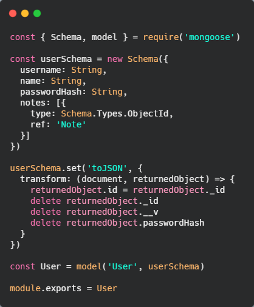
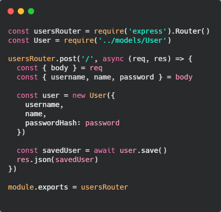
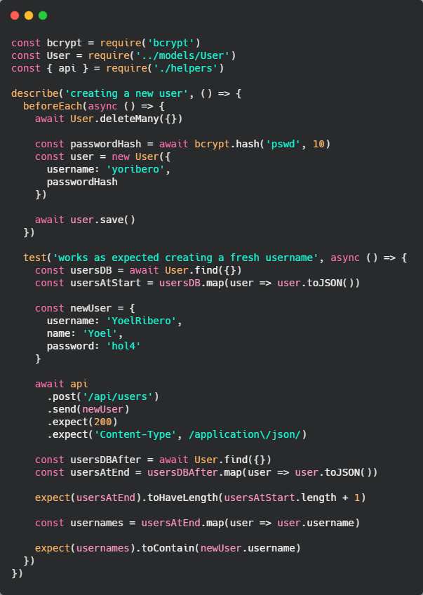

# 👨‍👩‍👧‍👧 Administración de Usuarios

Crearemos usuarios, utilizando nuestra api de notas, crearemos nuevos endpoints para usuarios, haremos la relación con nuestra colección de notas, además tendremos que hacer testing para asegurarnos que nuestro código funciona.

Debemos hacer administración de usuarios ya que nuestras notas, ahora mismo, están 'huérfanas', esto quiere decir que nuestras notas son anónimas, no tenemos un usuario al que están relacionadas. Lo que queremos es esto mismo, que las notas esten asociadas a un usuario y que cada nota solo sea de una persona a la vez, lo que si un usuario puede tener n notas asociadas a el, pero cada nota pertenece a un usuario.

## 🛐 Creando el modelo de usuarios

Al igual que lo hicimos con las notas debemos crear el modelo para los usuarios. Para crearlo nos basamos en el modelo de notas



Dentro de nuestra carpeta model, que creamos para el modelo de notas, creamos un archivo llamado `User.js`, este archivo tendrá nuestro modelo de usuarios.

El password lo ponemos como `String` por ahora pero luego lo transformaremos a hash, ya que NUNCA debemos guardar nuestras contraseñas como nos llegan, sino que la debemos guardar como hash.

En la key `notes`, guardamos todos los id's de las notas que creó el usuario, además de decirle el tipo de dato que vamos a guarda allí, debemos decirle que tiene una referencia al model `Note`, de esta forma, luego, podremos utilizar funcionalidades que tiene el modelo `Note`, dentro del modelo `User`.

Transformamos los datos que nos van a llegar a nuestra api, al igaul que en el modelo de notas transformamos algunas propiedades, pero para este caso, otra cosa que haremos es eliminar el password del objeto que nos devuelve, ya que no queremos que se nos filtre el hash del password del usuario.

Por último crearemos la instancia del modelo que llamaremos `User`.

Otra cosa que debemos cambiar es el modelo de notas, así tendremos relación de usuarios con nota tanto en el modelo de notas como en el de usuarios.

```
const noteSchema = new Schema({
  content: String,
  date: Date,
  important: Boolean,
  user: {
    type: Schema.Types.ObjectId,
    ref: 'User'
  }
})
```

## 📍 Endpoints para usuarios

Como nuestro `index.js` empieza a quedar muy grande utilizaremos controladores para manejar nuestros endpoints, tanto para las notas como para los usuarios.

Utilizamos un middleware para indicarle que en la ruta `/api/users` utilice nuestro controlador de rutas, lo hacemos de esta manera

```
app.use('/api/users', usersRouter)
```

Ahora, en la carpeta `controllers` creamos un archivo `users.js` donde manejamos los endpoints de nuestros usuraios. Debemos importar el `Router()` de express y el modelo de usuario que creamos anteriormente.

Lo primero que creamos es el endpoint para crear un usuario, lo primero es indicar el método que utilizamos para crear un usuario, ese es el método `post`

```
usersRouter.post('/', async () { ... })
```

Importante, ponemos el path de esa manera ya que nuestro root lo indicamos en nuestro index, que la ruta era, `/api/users`, por lo tanto si ponemos `/` ya nos encontramos en esa dirección ya que es relativo, apartir de allí accedemos a la dirección que queramos.



De esta manera queda creado nuestro endpoint para crear un usuario, si lo probamos nos debería devolver un objeto parecido a este

```
{
  "notes": [],
  "username": "YoelRib",
  "name": "Yoel",
  "id": "60625fcf3c35a41194c51652"
}
```

En `notes` nos crea un array vacío ya que este usuario no ha creado notas aún, nos devuelve también el `username`, `name`, `id`. Observar que no nos devuelve la contraseña ya que en el modelo indicamos que no la devuelva en el objeto que nos llega.

## 🔐 Encriptando contraseñas con bcrypy

Encriptaremos la contraseña que nos llega del usuario con **bcrypt** ya que no debemos guardar en la base de datos la contraseña como un `String` sino que debe ser guardada de manera encriptada. *Bcrypt* hashea nuestra contraseña de manera unidireccional.

Lo instalamos con `npm i bcrypt`.

Lo recomendado es utilizarlo de forma asíncrona, ya que este tipo de operación, hashear un password, suele ser bastante grande, entonces si bloqueamos la ejecución de node, puede pasar que comiencen a llegar peticiones, pero este se para porque detiene la ejecución mientras el hash sucede y por esto el servidor puede ir muy lento.

Creamos el hash para nuestra password en el controlador de usuraio

```
const saltRounds = 10
const passwordHash = await bcrypt.hash(password, saltRounds)
```

Utilizamos `await` para hacerlo de forma asíncrona, luego llamamos a `bcrypt`, que lo importamos anteriormente, y llamamos al metodo `hash()`, tendremos dos métodos para utilizar `hash()` (para usarlo de forma asíncrona) y `hashSync()` (para usarlo de forma síncrona). Este método recibe dos parámetros, el primero el elemento que queremos hashear, será nuestro password, y el segundo será la complejidad algorítmica en la que queremos se hasheee nuestro password, importante saber que, mientras más grande sea la complejidad, mejor será pero más tardará en generarse el hash.

Ahora si nos, si creamos un usuario, en la base de datos nos genererá algo como esto

```
{
  "_id":{"$oid":"60626561e469e507206261b9"},
  "notes":[],
  "username":"YoelRiDev",
  "name":"Yoel",
  "passwordHash":"$2b$10$4u59XX.XVuNMYYeHiflMk.m0OrVDAOETsC8hsKmi/1FIJ6tcYiZqi",
}
```

Vemos que la contraseña es creada en forma de hash.

## 🔎 Test para el endpoint post

Crearemos un test para comprobar que podemos crear usuarios correctamente, además veremos que lo que hicimos, hasta ahora, es crear el usuario pero no hicimos control de ningún tipo de error



Creamos un archivo `users.test.js`, importamos `bcrypt`, el modelo `User` y nuesta `api` para ejecutar nuestros endpoints.

Utilizamos el método `beforeEach()` para ejecutar código antes de que se ejecute antes de cada test. Dentro, lo primero que hacemos es borrar todos los usuarios existentes en nuestra base de datos, para luego crear un usuario. Recordar que la base de datos que manipulamos es la de test, y no la de desarrollo, mucho menos la de producción.

Algo que haremos, antes de seguir, es que cada vez que se ejecute nuestro test, lo haga desde un puerto distinto al de desarrollo, ya que podría traernos porblemas, para esto, en el script de test indicamos el puerto `"test": "cross-env NODE_ENV=test PORT=8081 jest --verbose --silent"`.

Nuestro primer test evaluará la creación de un usuario que no existe. Para esto, primero recuperamos las usuarios que hay en ese momento en la base de datos, luego recorremos esos usuarios y lo pasamos por el método `toJSON` así tenemos los datos de una manera amigable y con los datos que necesitamos para trabajar. Haremos un objeto que crea nuestro nuevo usuario `newUser`. Ahora desde nuestra `api` que importamos tenemos disponible el endpoint `post()` para guardar nuestro nuevo usuario y por ahora esperaremos un status code `200`, aunque luego lo cambiaremos. Para terminar, recuperamos nuevamente los usuarios de la base de datos y comprobamos que nuestro usuario fue creado correctamente, si es así la nueva colección debería tener un usuario más que la inicial y evaluamos si el `username` del nuevo usuario que creamos, existe en nuestra colección de usuarios.

Por último refactorizamos código y lo llevamos a nuestro helper para tener un código más limpio y menos repetitivo. Creamos una función `getUsers` que nos devuelve nuestros usuarios pasados por el método `toJSON()`

```
const getUsers = async () => {
  const usersDB = await User.find({})
  return usersDB.map(user => user.toJSON())
}
```

Importante tratar a los test como si fueren código de producción, esto quiere decir que, a pesar de que solo se ejecutan en desarrollo no significa que lo podamos hacer de cualquier manera, es importante tener un código prolijo, lintado, evitar repetición y mantener las mejores prácticas posibles.

## 🔬 Test Driven Development (TDD)

Es una forma de desarrollo en la que primero hacemos test y luego escribimos el código necesario para que el test funcione. Hecmos un test, con un caso de uso que queremos que tenga nuestra app, nos dará en rojo porque esa funcionalidad no se encuentra ahora mismo en nuestro código, conseguimos que nos de verde y a partir de ahí refactorizamos ya sea cambiando funcionalidad o también mejorando nuestro código.

Lo que conseguimos con esto, es que siempre tenemos un loop en donde nos apoyamos en el test primero y no en la funcionalidad.

Continuamos creando el test para evaluar que si un usuario ya existe no puede ser creado.

```
test('creation fails with proper statuscode and message if user is already taken', async () => {
  const usersAtStart = await getUsers()

  const newUser = {
    username: 'YoelRibero',
    name: 'Yoel',
    password: 'hol4'
  }

  const result = await api
    .post('/api/users')
    .send(newUser)
    .expect(400)
    .expect('Content-Type', /application\/json/)
  
  expect(result.body.error).toContain('`username` to be unique')
  
  const usersAtEnd = await getUsers()
  expect(usersAtEnd).toHaveLength(usersAtStart.length)
})
```

Es muy parecido al test creado anteriormente con la diferencia de que esperamos que no se cree y que nos de un error. Si lo ejecutamos va a fallar por lo que hablamos de *TDD*, ahora debemos hacer que ese test funcione.

Existe un librería de mongoose llamada **unique-validator**, este nos permite indicar, en nuestro modelo, que campos queremos que sean únicos, esto será de mucha utilidad porque nos resuelve un montón de cosas y es una comprobación que seguramente debamos hacer en mas de un lugar. La instalamos con `npm i mongoose-unique-validator -D`

En nuestro modelo importamos nuestra nueva librería y la key `username` pasará a ser un objeto donde le indicamos, el tipo de dato que va a contener y le agregamos la propiedad `unique` y se la seteamos como `true`. Por último debemos aplicar el pluin al schema.

Al agregar esta propiedad y realizar los cambios pertienentes en nuestro código del endpoint, se agrega `try and catch` para manejar el error, nuestro test asa a dar el código está ok.

Podríamos hacer más validaciones, por ej, que el largo del username no tenga más de n caracteres, etc. mongoose nos lo permite y ya lo trae preparado.

## 🤝 Relaciones entre colecciones

Haremos crecer nuestro controlador de users, continuamos con nuestro endpoint `get` para nuestra ruta de usuarios.

```
usersRouter.get('/', async (req, res) => {
  const users = await User.find({})
  res.json(users)
})
```

Vemos que tanto nuestro endpoint para el `post()` como para el `get()` lo hacemos al mismo path, esto es porque estamos utilizando REST API en donde un mismo path nos sirve para diferentes funciones, dependiendo de la acción que utilizamos.

Recuperamos todos los usuarios y los retornamos como un json. Otra cosa que debemos agregar es el test para esta ruta.

Si observamos la respuesta, y hay usuarios creados nos devolverá esos usuarios pero si vemos el array de notas estará vacío.

Ahora, en el controlador de usuarios debemos validar que cuando un usuario crea una nota se la asigne al mismo.

Lo haremos en el endpoint para el `post()`, le debemos indicar que cuando se crea una nota también debe recibir el usuario que la está creando.

```
// create note
notesRouter.post('/', async (req, res, next) => {
  const { 
    content, 
    important = false,
    userId
  } = req.body

  const user = await User.findById(userId)

  if (!content) {
    return res.status(400).json({
      error: 'Note content is missing'
    })
  }

  const newNote = new Note({
    content,
    important,
    date: new Date().toISOString(),
    user: user._id
  })

  try {
    const savedNote = await newNote.save()
    // add note to user in db
    user.notes = [...user.notes, savedNote._id]
    await user.save()
    res.json(savedNote)
  } catch(e) {
    next(e)
  }
})
```

Lo primero, recuperamos los valores que necesitamos de la nota, ahora agregamos el `userId`, luego, utilizando el modelo del usuario buscamos el usuario correspondiente mediante el método `findById()`

Al crear la nueva nota en la propiedad `user` le pasaremos el id que encontramos en la base de datos, como lo estamos buscando en la base de datos el id lo debemos citar con `_id`.

Como dijimos, esta información la vamos a tener tanto en las notas, como en el usuario, así que una vez que tenemos la nueva nota y antes de enviar la respuesta, con el usuario que recuperamos de la base de datos accedemos a las notas y le agregamos la nueva nota que creó. De esta manera nos aseguramos que tanto el usuario como las notas etán asignadas a un usuario.

Tenemos un primer relación bidireccional, lo que qeremos ahora es que cuando nos dan info de la nota, no solo nos diga el id del usuario, sino que nos de toda la información del mismo.

En *mongoose* existe un concepto llamado **populate**, es un método que utiliza las referencias que creamos en el modelo y recupera la información para "rellenar" la información, en este caso del usuraio, donde la necesitamos.

Nos vamos al controlador de usuarios, y en el método `get` cuando recuperamos las notas le pasamos el método populate

```
usersRouter.get('/', async (req, res) => {
  const users = await User.find({}).populate('notes')
  res.json(users)
})
```

Al método `populate` le decimos que lo que queremos es que nos "rellene" con las info de las `notes`, va así, en minúscula y en plural, de esta forma eso buscará el modelo que creamos (user) y tenía referencia al modelo `Note`, de este forma cuando le decimos que tiene que popular `notes`, lo que hace es buscar el `ObjectId` y se trerá toda la información de las notas.

Ahora si hacemos un get de los usuarios vemos que vendrá con toda la información de las notas.

Es importante saber que lo que hacemos aquí **no es transaccional**, con esto queremos decir que, mientras hacemos estas operaciones no se bloque la escritura de los documentos, esto significa que, podría pasar que mientras recuperamos la data de usuarios, otra persona a la vez lo haya borrado, esto hace que tengamos información de un usuario cuando ya no existe. Esto es algo que ocurre en aplicaciones con mucha escritura, pero es algo que debemos tener en cuenta, pueden ocurrir varias acciones al mismo momento y no se bloquearán.

Otra cosa que debemos ver es la respuesta, nos devuelve cosas que tal vez no todas son necesarias, por ejemplo en el `user.notes` nos devuelve el `userId` esa es una info que no necesitamos ya que la tenemos en el propio objeto user.

Cuando hacemos el `populate` le podemos indicar, como segundo parámetro lo que queremos que añada del objeto, por defecto nos trae todas, pero le podemos indicar cuales queremos.

```
usersRouter.get('/', async (req, res) => {
  const users = await User.find({}).populate('notes', {
    content: 1,
    date: 1
  })
  res.json(users)
})
```

Con esto le decimos que nos traiga el content y la date, si miramos el objeto que nos devuelve ahora vemos que nos trae solo eso, además también nos trae el `id` de la nota. La siempre nos la traerá a menos que indiquemos lo contrario. Si no quisiéramos el `id` se lo indicaríamos de esta manera `_id: 0`. En nuestro caso tiene sentido el id de la nota.

Ahora haremos lo mismo, pero con el controller de notas. Le pasamos el populate para que nos traiga los datos del usuario que la creó.

```
usersRouter.get('/', async (req, res) => {
  const users = await User.find({}).populate('notes', {
    content: 1,
    date: 1
  })
  res.json(users)
})
```

En este caso el nombre al que hacemos referencia en el populate es en minúscula y singular ya que la propiedad referencia que está en el modela de notas está escrita de esa manera.
