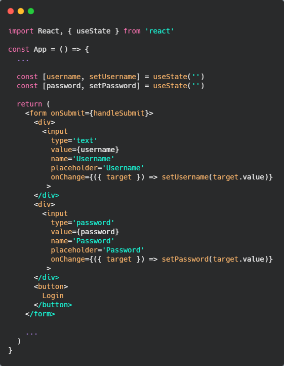
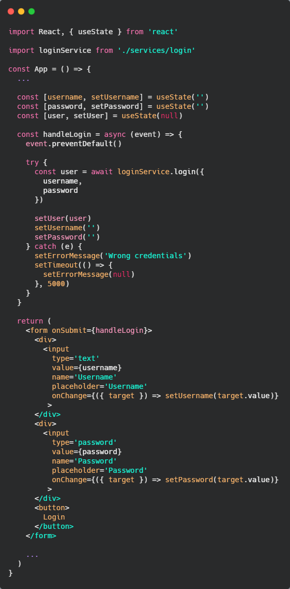
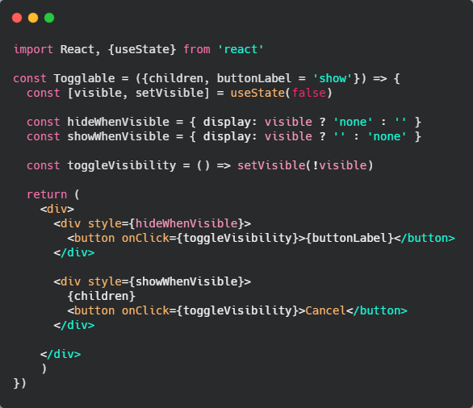

# 🔍⚛ Testing React Apps

## 🔑 Sesión de Usuario en REACT

Para esta sección volvemos al FrontEnd, lo que haremos aquí es conseguir iniciar sesión, guardaremos el token, o sea, debemos presentar un formulario en el que se iniciará la sesión, una vez tenemos la sesión, recuperamos el token, lo guardamos, de esta forma tendremos la sesión del usuario en el token.

Si abrimos nuestra app del `FrontEnd` debería listarnos las notas que hemos creado en nuestra base de datos. Si quisiéramos crear una nota en este momento no nos dejaría, ya que no tenemos token.

En nuestro componente `App.js` crearemos un estado con `useState` para el usuario y el password que ingresará el usuario. Este estado lo debemos manipular mediente un formulario, así que creamos uno.



De esta manera tenemos creada la interfaz para comunicarnos con nuestro backend y poder iniciar sesión.

Ahora debemos crear esta comunicación para enviarle los datos del login a nuestra api, para esto creamos en nuestra carpeta `services` del frontEnd, un archivo llamado `login.js`

```
import axios from 'axios'

const baseUrl = 'http://localhost:3001/api/login'

const login = async credentials => {
  const { data } = await axios.post(baseUrl, credentials)
  return data
}

export default { login }
```

Importamos axios para poder trabajar de una manera más sencillas nuestras peticiones, luego la url base será la de nuestro backend local y por último creamos la función que hará el post a nuestro backend con las credenciales que recibirá desde el front.

Ahora en nuestro archivo `App.js` importaremos nuestro servicio para el login y lo ejecutaremos cuando se haga submit al formulario.

Crearemos un nuevo estado llamado `user` para guardar los datos del usuario, una vez que se logea.



Como se ve en el código, el manejador `handleLogin` se encargará de guardar los datos en nuestro backend. Primero prevenimos su comportamiento habitual y le decimos que cuando se haga submit haga lo que viene debajo y no utilizar el atributo action de nuestro form. Luego guardamos nuestro usuario, que lo obtenemos de ejecutar nuestro servicio con las credenciales del usuario. Este usuario lo guardaremos en nuestro nuevo estado que creamos `setUser(user)`, ahora reseteamos el valor de los estados `username` y `password`. Por último en el control del error, en caso de que lo haya, seteamos nuestro estado de error con un mensaje y luego de 5 segundos lo quitamos.

De esta forma estamos haciendo que el usuario inicie sesión, pero esta sesión no la estamos haciendo perdurar en el tiempo. En este mometno estamos renderizando el formulario de login y el formulario para crear una nota a la misma vez, lo cual es absurdo porque si el usuario no inició sesión no debería poder crear una nota.

Haremos un renderizado condicional de ambos formularios, lo que determina la impresión de uno u otro es si tenemos usuario o no, por ende haremos un *conditional rendering* para este caso.

Es **importante** no crear componentes dentro de otros componentes, si tenemos algo que se ve igual que un componente, es mejor, hacer uno, separar y tener componentes reutilizables. Ya que al crear componentes dentros de otros podemos tener problemas de performance ya que cada vez que se renderice el componente también se va a renderizar el componentes que creamos dentro y eso no es una buena práctica.

Ahora que tenemos el renderizado condicional de los formularios, debemos habilitar la creación de notas para el usuario logeado, para esto iremos al método `addNote()`, en el método `create` debemos pasar el token como parámetro. Luego debemos ir al servicio de notas y agregar un segundo parámetro `{token}` para poder enviarselo en nuestro `post`.

Como sabemos, el token tiene que ser enviado en el header, así que crearemos una variable `config` y dentro le creamos una key `headers` que dentro tendrá una propiedad `Authorization` y como valor tendrá nuestro token

```
const create = (newObject, {token}) => {
  const config = {
    headers: {
      Authorization: `Bearer ${token}`
    }
  }

  const request = axios.post(baseUrl, newObject, config)
  return request.then(response => response.data)
}
```

Ahora si quisiéramos crear una nota deberíamos poder y si refrezcamos la página la nota debe estar creada en la base de datos.

## 🛢 Guardar usuario en LocalStorage

Como vemos al recargar no nos mantiene la sesión del usuario, si refrezcamos nos muestra el formulario de login, cuando en realidad el usuario ya se había logeado.

Para que la sesión persista lo que podemos hacer es guardar el token de la sesión en `localStorage`. Lo hacemos nuestro `handleLogin` de la siguiente manera

```
window.localStorage.setItem(
  'loggedNoteAppUser', JSON.stringify(user)
)
```

Utilizamos el método `stringify` para guardarlo como un string ya que localStorage necesita guardarlo de esa forma.

Para leer el localStorage crearemos un efecto con `usseEffect`

```
useEffect(() => {
  const loggedUserJSON = window.localStorage.getItem('loggedNoteAppUser')

  if (loggedUserJSON) {
    const user = JSON.parse(loggedUserJSON)
    setUser(user)
    noteService.setToken(user.token)
  }
}, [])
```

Note: ponemos `window.localStorage` y no `localStorage` ya que consideramos buena práctica poner de donde salen los métodos, como localStorage es una propiedad global no tendrá problema en leerlo de cualquiera de las dos maneras, pero puede ser relevante poner de donde sale ese método que en este caso es el objeto `window`.

Entonces, si tenemos el JSON del usuario logeado lo recuperamos parseando el JSON, con el método `JSON.parse()` y una vez tenemos el objeto del usuario hacemos un `setUser()` del mismo y por último con el servicio de notas y su método `setToken()` le decimos el cual es el token del usuario.

Importante es que le pusimos como dependencia, al efecto, un array vacío, por ende solo se ejecutará una vez que cargue la página.

Ahora que tenemos el inicio de sesión podemos también hacer un logout, agregando un botón por deslogearnos y haciendo que manejador tenga el siguiente código

```
const handleLogout = () => {
  setUser(null)
  noteService.setToken(user.token)
  window.localStorage.removeItem('loggedNoteAppUser')
}
```

## 🍪 Cookies

En React no nos debemos preocupar de los ataques de inyecciones de scripts en nuestras aplicaciones. En el caso de nuestro form para crear notas, por ej, si un usuario nos pone `<script>alert('hello')</script>`, React lo detectará como un texto plano y no como un script. Esto es bueno porque previene ataques y agujeros de seguridad en nuestra aplicación.

Las cookies nos permites tener una sesión guardada, al igual que con localStorage, pero de manera más segura. Hay diferentes tipos de cookies.

Para el caso de nuestra apliación, usamos localStorage ya que no será necesaria tanta seguridad.

Lo ideal para apliaciones grandes sería utilizar **cookies**, **http only**, **cookies same site** y que sea **estricto**, esto hace mucho más complicado de desarrollar ya que hablamos de seguiridad.

## 🔃 Refactorización de componentes

Si observamos nuestro componente `App.js` tenemos un componente que tiene demasiada información y hace demasiadas cosas, esta no es la forma de trabajar con React. Ahora separamos funcionalidades en distintos componentes.

Extraemos el formulario de login para un componente llamado `LoginForm.js`. Para que funcione debemos tener el **estado** del login en ese componente, el estado del login y del usuario se lo pasaremos como `props` al componente.

```
<LoginForm 
  username={username}
  password={password}
  handleUsernameChange={
    ({target}) => setUsername(target.value)
  }
  handlePasswordChange={
    ({target}) => setPassword(target.value)
  }
  handleSubmit={handleLogin}
/>
```

Algo nuevo que no habíamos notado antes, es que podemos pasar una función como prop a un componente, esta se ejecutará en el momento que le indiquemos en el componente.

Lo que no queremos ahora es que cuando cerramos sesión nuestro formulario aparezca si o si, sino que el usuario tenga control de si quiere o no ver el formulario de login.

## 👨‍👧‍👦Utilizando la prop children

Para hacer la funcionalidad que comentabamos antes crearemos un componente llamado `Togglable.js`, este componente se encargará de mostrar o no cierto contenido.

En React tenemos una prop para que el componente renderice lo que nosotros le indicamos como contenido a ese componente. Esto lo hacemos de la siguiente manera, suponemos que tenemos este componente

```
export const Togglable = () => <h1>Togglable<h1>
```

Lo que podemos hacer es que ese componente reciba una prop `message` para que imprima lo que le llega en esa prop, y así volverlo más dinámico.

```
Import File
<Togglable message='Togglable' />

File Togglable.js
export const Togglable = ({ message }) => <h1>{ message }<h1>
```

Pero podríamos ir un paso más y es que si nosotros le indicamos contenido al componente en la sección donde lo ejecutamos, y luego le pasamos la prop `children` el renderizará lo que tenga dentro

```
Import File
<Togglable>Togglable</Togglable>

File Togglable.js
export const Togglable = ({ children }) => <h1>{ children }<h1>
```

De esta manera el componente muestra lo que envuelve. Esto podría ser cualquier tipo de cosa, por ejemplo crear un markup para que haya dentro de ese componente, incluso otros componentes.

De este manera, nuestro componente `Togglable` ahora tendrá un estado para manejar la visibilidad de el contenido que le pasamos.



Como se puede ver el componente se encargará de hacer visible o no su contenido. Para manejar la visibilidad en este caso no utilizamos renderizado condicional, sino estilos en línea, en los que indicamos un display en caso de que sea visible o no. Esto se diferencia del renderizado condicional en que cuando es con estilo el componente si que se renderiza pero se oculta por estilos, en el renderizado condicional el componente no se muestra.

Lo importante de este componente es que no le va a importar quién es el children, lo premos utilizar con cualquier componente que queramos que el control del mostrado lo tenga el usuario.

Otra cosa muy interesante es que la label del botón la recibe por props. Esto es importando ya que podemos indicarle al usuario que es lo que se va a mostrar.

En este momento ya estamos en condiciones de hacer lo mismo con el form para crear una nota. Lo primero que hacemos es separarlo del componente App creando un componente `NoteForm.js`.

Haremos algo muy parecido que con el componente de login, que tuvimos que psarle todo el estado a travéz de las props.

Esto es muy importante hacerlo, para que nuestro componente `App.js` comience a perder peso, y no cargue con todo el render de elementos.

Cuando estamos desestructurando componentes, nos surge la duda de, ¿Dónde va el estado de nuestros componentes?. En la documentación de react nos dicen que, cuando tenemos diferentes componentes que reflejan datos, y esos datos son el estado y hay que escuchar esos cambios para que cambie la UI, es importante que ese estado esté en la posición donde pueda ser compartido por esos componentes. 

Utilizando esta premisa vemos que en el componente `App` tenemos varios estados que los utilizamos solo en un lugar, o sea que elevemos el estado a un sitio que no vale la pena porque no es un estado compartido. Como ya sabemos es importante tener la mínima cantidad de estados posibles en un componente.

Mandaremos todos lo que refiere al estado de la nota al componente `NoteForm.js`, esto nos permitirá tener el estado controlado en nuestro componente.

Lo que si dejaremos en el componente `App` es al añadir una nota, ya que eso si lo necesitamos a ese nivel, porque es utilizado por otro elemento. El método `addNote()` haremos que se le pueda pasar por parámetro el objeto de la nota.

A partir de ahora el `NoteForm` recibirá un parámetro que será `addNote={addNote()}`, y en el componente utilizaremos ese método cuando el usuario hace submit del formulario de notas.

```
NoteForm.js
...
const handleSubmit = (event) => {
  event.preventDefault()

  const noteObject = {
    content: newNote,
    important: Math.random() > 0.5
  }

  addNote(noteObject)
  setNewNote('')
}
...

App.js
...
const addNote = (noteObject) => {
  noteService
    .create(noteObject)
    .then(returnedNote => {
      setNotes(notes.concat(returnedNote))
    })
}
...

return (
  ...
  {
    user
      ? <NoteForm 
          addNote={addNote}
          handleLogout={handleLogout}
        />
  }
  ...
)
```

De esta manera mantenemos en el sitio adecuado cada funcionalidad del componente.

También agregamos nuestro componente `Togglable` en el componente `NoteForm` para darle control al usuario si quiere visualizar el formulario de crear una nota.
