# Bootcamp Full Stack Open

## 🧾 Índice de Contenido

* [Introduccion 💻](#user-content--introducción)
  * [Inspección de una página web 🔎](#user-content--inspección-de-una-página-web)
  * [DOM (Document Object Model) 🏝](#user-content--dom-document-object-model)
  * [CSS (Cascading Style Sheets) 📌](#user-content-css-cascading-style-sheets)
  * [Peticiones a un servidor ⏳](#user-content--peticiones-a-un-servidor)
  * [Formularios y HTTP Post 📑](#user-content--formularios-y-http-post)
  * [AJAX (Asynchronous JavaScript and XML) 🔃](#user-content--ajax-asynchronous-javascript-and-xml)
  * [Single Page Application (SPA) 🆒](#user-content--single-page-application-spa)
  * [Librerías JavaScript 📒](#user-content--librerías-javascript)

# 💻 Introducción

Antes de comenzar a programar es importante conocer los principios y las partes quetiene el desarrollo de una aplicación web.

Prestamos atención en los siguientes puntos:
* Hacer un request
* Creación del árbol de elmentos y que es el árbol de elementos
* Diferentes lenguajes que componen una página web
* Herramienta que utilizamos para ver esto

## 🔎 Inspección de una página web

Tenemos diferenctes opciones para hacer esto. Tomamos como referencia la siguiente [aplicación web](https://studies.cs.helsinki.fi/exampleapp/).

Para inspeccionar una web tenemos tres métodos diferentes:
* En cualquier lugar de la página presionar click derecho y click en la opción que dice **"Inspeccionar"**
* En opciones del navegador (suele estar marcada con tres puntos uno arriba de otro) -> **Herramientas** -> **Herramientas para desarrolladores**
* Simplemente presionando la tecla F12

Para este apartado nos enfocaremos en dos pestañas, **Consola** y **Network** pero sobre todo en esta última.

En la pestaña network podemos inspeccionar las request que tiene esta web. Las **request** son los recursos que está cargando esta página para funcionar.

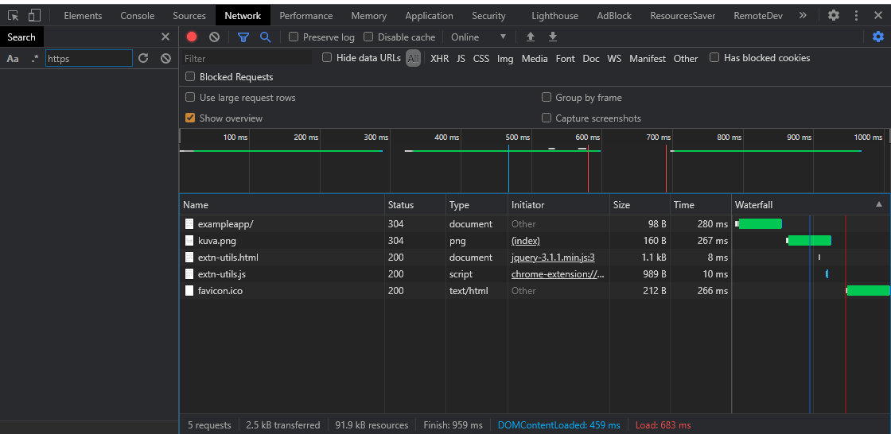

Tenemos varios recursos que estan creando esta página web, el primero es la request principal, es la que cuando entramos a la url nos devuelve la request a la url https://studies.cs.helsinki.fi/exampleapp/, la misma es de tipo GET (tenemos diferentes tipos de peticiones), nos da un código de estado que nos dice que la url respondió bien.
Luego tendremos las cabeceras (Headers) que pueden ser de respuesta (Response Headers), nos da la información de la respuesta a la petición, y las de Request (Request Headers), estas nos dan información de lo que nosotros enviamos al servidor.

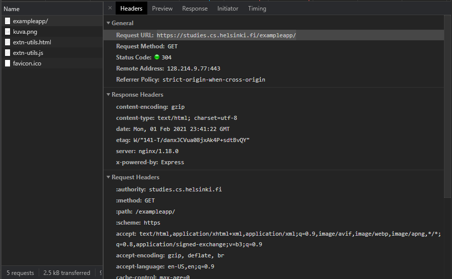

Lo importante de esto es la pestaña que nos dice la respuesta de este request. Allí podemos ver la primera escencia de la web, el **HTML**, basicamente es el marcado de nuestra página web, este HTML es el que hace que nuestra web tenga información de algún tipo.

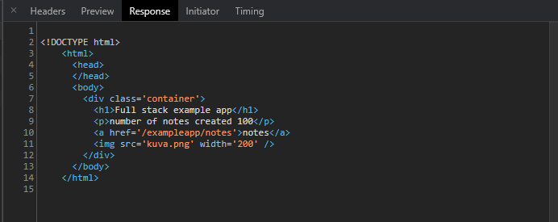

En definitiva el HTML es lo que nos devuelve el servidor en el primer request.

También podemos observar otros request como la imágen que tiene la web y el favicon del mismo.

Dentro de la pestaña network también tenemos un checkbox para decirle al navegador si queremos tener activada o desactiva la cache.
La **cache** nos sirve para almacenar datos y que estos no se vuelvan a cargar cuando visitamos un sitio que ya habíamos visitado anteriormente. Esto optimiza la carga de recursos. Para el desarrollo varias veces la tendremos deshabilitada porque queremos tener la última versión del sitio que estamos desarrollando y no que nos queden cosas viejas que queremos cambiar.

Ahora si abrimos el link a notas de nuestra web nos lleva a otra página con nuevos recursos, lo recursos que trae son los básicos que puede contener una página web.

El primero que carga cumple la misma función que el anterior, nos trae el HTML de nuestra web. Pero el segundo que nos trae es la siguiente pata de la web, el **css**.

Es el lenguaje que le da estilo a la web, en este caso son 8 líneas css.

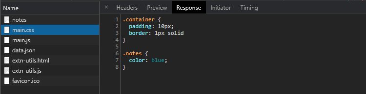

Por otro lado tenemos el javaScript, lo que hace es un petición asíncrona, mediante ajax, al servidor y cuando lo consigue pinta el contenido en la pantalla.

También tenemos un documento en formato JSON (JavaScript Object Notation) que nos trae todas las notas que varemos en la página en formato JSON (formato que suena familiar por el parecido que tiene con los objetos).

## 🏝 DOM (Document Object Model)

Es el árbol de elementos de nuestra página web. Se dice que es un árbol porque tiene una raíz que es el html y luego de allí se desprenden todos los elementos del documento (remas).

Con el DOM podemos ver, modificar, añadir y/o escuchar eventos, cuando ocurre una acción del usuario.

Si vemos el javascript de la página de notas tenemos un javascript que como dijismos hace una petición asíncrona mediante AJAX.

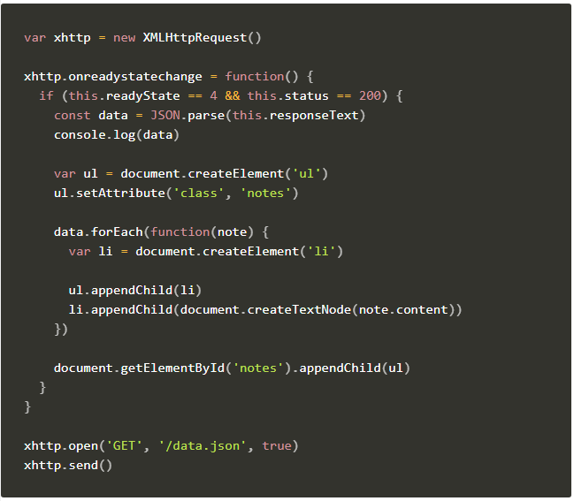

Dejaremos de lado la petición, pero si vemos el data, vemos que recorre esta data, luego crea un elemento ``li`` por cada nota recorrida. Además el elemento ``li`` lo agrega al ``ul`` que creó antes del recorrido con la clase **notes**. Al elemento ``li`` le crea un nodo de tipo texto y le agrega el contenido de la nota.

De esta manera es como se manipula el árbol de elementos DOM.

Podemos observar, mediante la **consola**, que cosas tiene el DOM, poniendo ``document.`` nos lista todas las cosas que podemos hacer con el documento.

Otra prueba que podemos hacer es revisar la cantidad de anchors que tenemos en una web, esto lo hacemos con ``document.querySelectorAll('a')`` y nos listará todos los anchor que tiene la página. 

En caso de querer seleccionar un solo elemento lo podemos hacer con ``document.querySelector('a')`` y nos mostrará el primer anchor que tiene la página.

También podemos cambiar el contenido de un elemento html, esto lo hacemos con ``document.querySelector('a').innerHTML = '<strong>Cambiar por esto</strong>'`` esto nos cambia el HTML directamente de lo que había en ese elemento.

En caso de querer cambiar solamente el texto y no todo el contenido html, podemos hacer lo siguiente ``document.querySelector(a).textContent = 'Cambia texto por esto'``.

Como esta hay muchas formas más de modificar el DOM.

## 📌 CSS (Cascading Style Sheets)

Una de las cosas importantes que nos dan las herramientas de desarrollo es poder modificar el CSS de la página mediante el inspector.

Si miramos los request de nuestra web de notas vemos que tenemos un archivo ``main.css`` que contiene los estilos que tendrá nuestra web.

La pestaña **Elementos** permite ver los atributos de un elemto html.

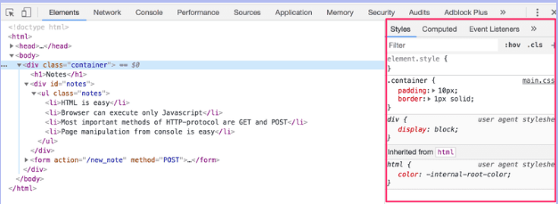

Allí se ve como el elemento con la clase ``container`` tiene un relleno de ``10px`` y un border sólido de `1px`.

Ahí mismo donde están definidos los estilos podemos modificar, para hacer pruebas, los estilos nuevos que queremos probar. Una vez recargada la pàgina estos datos se pierden pero es de mucha utilidad cuando queremos probar si una idea funciona antes de llevarla al código.

## ⏳ Peticiones a un servidor

Cuando pedimos un recurso lo que estamos haciendo, como clientes, es hacer una petición a un servidor. En el siguiente esquema tenemos lo que pasa cuando entramos a la página web.

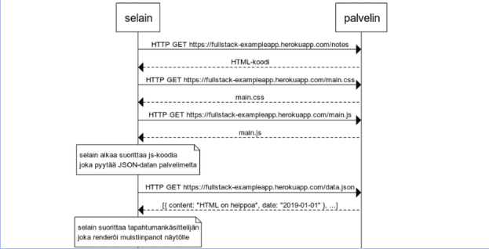

Podemos ver como cuando ingresamos al sitio tenemos la primer request que es la pàgina de notas, llega al servidor y lo que hace este es devolver el código HTML. Luego va a solicitarle al servidor el css, el servidor devuelve el css. Y lo mismo hace con el javascript.

Hasta ahí era el browser el que se encargaba de hacer las peticiones, como el JavaScript tiene la petición de las notas, es este el que se encargará de hacer el pedido de las notas al `data.json`, hace una petición `GET` al servidor. El servidor le devuelve el JSON de las notas, una vez obtenido los datos el javascript pinta los datos en el navegador y es ahí cuando podemos ver las notas.

Las peticiones ocurren algunas en **paralelo** y otras en **cascada**. Una vez que se carga el html podemos ver que el es el que dice que tiene que cargar el css y el js que tiene en el head. Entonces esas dos peticiones si están ocurriendo en paralelo, tanto el css como el js se cargan de esa manera, por más que en el diagrama parezca que no.

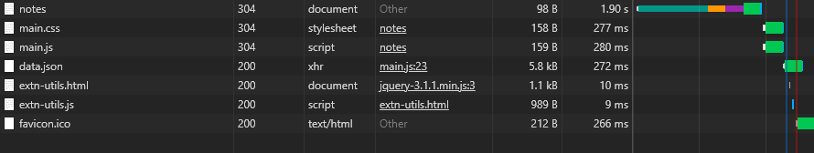

Los carga en paralelo porque una vez cargado el html si que ahí sabe cuales son los recursos que va a necesitar, pero hasta entonces tiene que esperar a la request principal. También podemos observar como el json se carga luego que termina de cargar el javascript. 

Por esto es que algunas peticiones serán cargadas de forma paralela y otras en cascada.

Como vemos en la imagen el favicon es un recurso que se carga al final, esto es porque no es un recurso necesario para que el sitio funcione correctamente.

Los recursos tienen diferentes prioridades, podríamos añadir otra pestaña **Priority** para ver la prioridad para cargar que tiene cada recurso. El html y el css son los que tienen la prioridad más alta, ya que son los que hacen que la página se pueda mostrar correctamente, luego le seguirá el javascript.

Como el css afecta al DOM necesitamos que el css sea cargado antes que el javascript, por si queremos cambiar estilos desde javascript, para no cambiar un elemento desde javascript antes de que css sea cargado.

En HTML tenemos diferentes etiquetas para cambiarles la prioridad a un recurso y darle una pista al navegador que recurso es más prioritario. Igualmente el navagador hace este trabajo por nosotros y no necesita que le indiquemos la prioridad de cada elemento.

## 📑 Formularios y HTTP Post

Los formularios son una parte muy importante en el desarrollo web ya que son los que nos permiten enviar información al servidor.

Se vió como con una petición de tipo GET podemos recuperar las notas del servidor, pero si queremos crear una nota? para esto mismo existen los formularios como forma básica de lograr la comunicación con el servidor para crear cosas.

El tipo de petición que utilizamos para crear datos en un servidor se denomina **POST**.

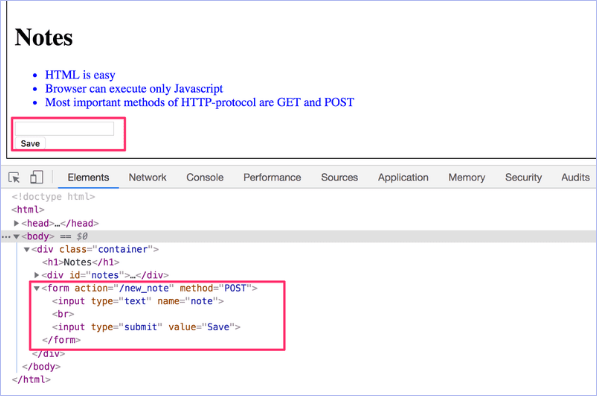

Como se dijo el formulario nos va a servir para enviar datos a un servidor.

En la etiqueta `<form>` le vamos a indicar la acción que tendrá con el atributo `action=""` y el método que tendrá, que será `method="POST"`. 

La acción será una dirección que el servidor debe comprender de forma que sepa leer lo que le enviamos a travéz del primer `input`  en su atributo `name` que es la nota. Una vez que le llega el recurso lo puede guardar en la base de datos.

Como prueba podemos enviar una nota a travéz del formulario que se encuentra en nuestra web de notas.

Al enviar una nota, se recargará, irá a la página donde crea nuestra nota y luego hará una redirección hacia la página de notas. Veremos que lo primero que se hizo fué una petición de tipo POST y podremos ver cual fue el dato que enviamos a la base de datos. Si miramos el final de las notas veremos nuestra nota creada.

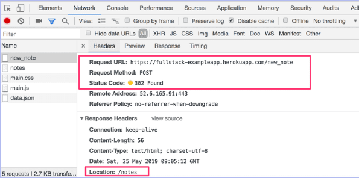

## 🔃 AJAX (Asynchronous JavaScript and XML)

Son peticiones asíncronas que se hace a un servidor para recuperar o guardar datos, a grandes razgos.

Volviendo al ejemplo de crear una nota podríamos utilizar AJAX para no tener que recargar la página y hacer todo el proceso de crear la nota y recuperar todas notas.

Con AJAX simplemente podríamos hacer que cada vez que se crea una nota javascript se encargue, mediante AJAX de pedir todas las notas, y así nos ahorramos el tiempo de espera que conlleva recargar una página.

Actualmente existen tecnologías más avanzadas que nos permiten hacer estas peticiones de forma más sencilla.

## 🆒 Single Page Application (SPA)

Son páginas que no refrezcan cada vez que se necesita navegar o visualizar contenido diferente.

Lo que hacen es cambiar información que tiene actualmente en el DOM por información nueva. Actualiza la información que hay en DOM sin necesidad de refrezcar nada.

| 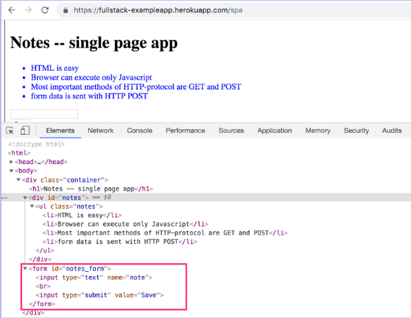 | 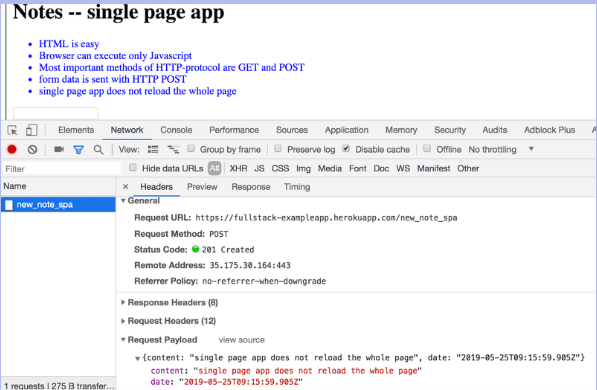 |
| ------ | ------ |

Como se ve, en este caso el formulario no tiene una acción y tampoco un método, sino un `id` con el que va a ser identificado desde javascript.

Lo que ocurre ahora cuando creamos un nota es que no refrezca la página sino que lo crea desde AJAX y recupera todas las notas con el mismo procedimiento.

Con esto evitamos el recargado de la página y con ello el recargado de todos los recursos nuevamente. Con AJAX solo nos traemos un recurso, que es la creación de una nota.

Si revisamos el javascript podemos notar algunos cambios.

| 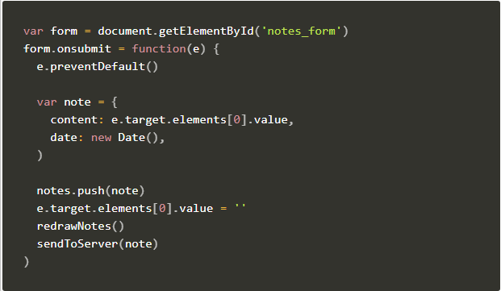 |  |
| ------ | ------ |

Podemos ver como se guarda el formulario en una variable para luego saber el momento en el que se hace submit del mismo y poder enviar el contenido de ese form como una nota.

En la segunda imagen se ve el código utilizado para realizar la petición POST y así enviar la nota hacia el servidor mediante el método POST.

## 📒 Librerías JavaScript

Lo que venimos viendo hasta ahora de JavaScript es lo que denominamos **Vanilla JavaScript**, es código nativo del lenguaje, es de mucha utilidad e importancia saberlo pero tenemos herramientas que nos facilitan el uso del lenguaje de programación.

Una de las librerías más utilizadas es **jQuery**. Esta es una librería ya no es la solución por defecto en la que deberíamos pensar cuando queremos hacer una aplicación con javascript. Es interesante aprenderlo ya que hay muchísimas webs que están hechas con jQuery. Tiene una forma de trabajar bastante antigua pero que en su momento ahorró mucho trabajo y simplificar el desarrollo.

JQuery fue precursor de muchos cambios que hoy podemos ver en el lenguaje JavaScript, un ejemplo claro es el `document.querySelector()` que surge gracias a jQuery. Cambió la forma de manipular el DOM.

Luego de jQuery el fron-end fue creciendo cada vez más, de ahí es que aparecen nuevas librerías con **Backbone JS** que nos daba una estructura para crear una aplicación web utilizando un patrón en concreto, también nos daba modelos, vistas, colecciones, controladores, pero backbone no es lo que se utiliza actualmente.

Luego de este último aparecen los Fremeworks modernos como lo son **React JS**, **Vue JS**, **Angular**, **SVELTE**.

⚛ El framework que utilizaremos en el bootcamp es **React JS** ya que actualmente es el más buscado y utilizado. Es el framework por excelencia para construir interfaces de usuario.
